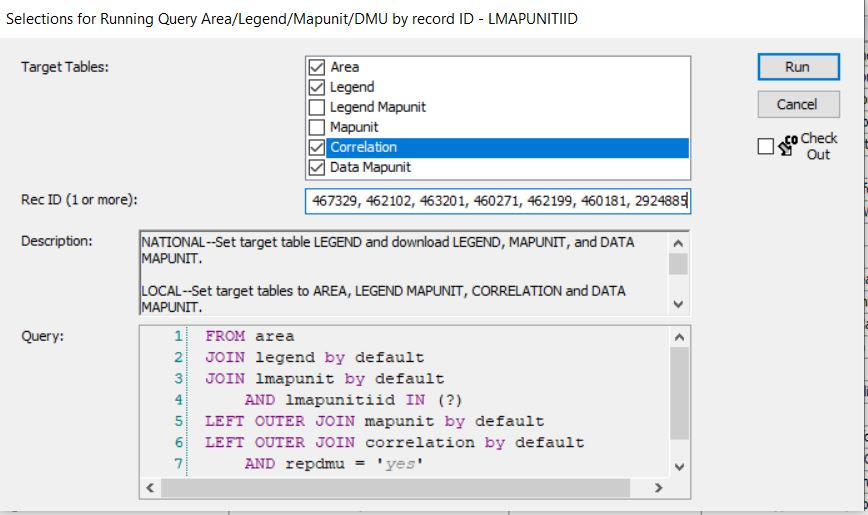
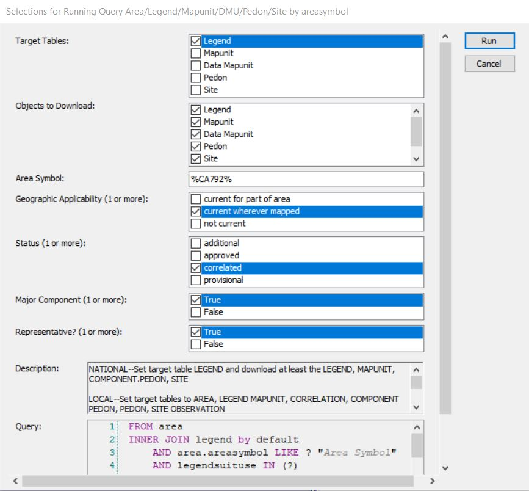
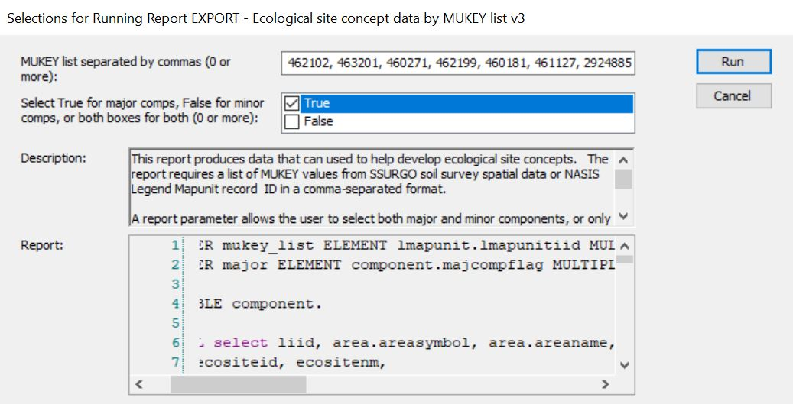

# Components

Components are one of the core concepts in the NRCS ecological workflow. Ecosites are correlated to components. This 

## Identify components in MLRA? {#componentsinMLRA}
There are NASIS Queries that allow querying by MLRA. Unfortunately, this is not the best approach. See the section [What mapunits are in an MLRA](#mapunitsinMLRA) for an explanation of why. Spatial intersection of MLRA boundaries and mapunits is more reliable. 

1. Determine the mapunits in the MLRA using the [Mapunits in MLRA tool](#mapunitsinMLRA)
2. Take the group of mapunits and enter them into Query > MLRA09_Temple > ARE/LMU/MU/DMU by Lmukey list.

Run against National Database:


Run against Local: 


3. Acquire the component names and component IDs using R:

Load the soilDB package and fetch NASIS data
```{r, eval=FALSE}
library(soilDB)
my.components.MLRA <- fetchNASIS(from = "components")
```


```{r, echo=FALSE, message=FALSE}
library(soilDB)
my.components.MLRA <- fetchNASIS(from = "components", dsn = "C:/Users/Nathan.Roe/Documents/ESS-FAQ/SQlite_tables/components18.sqlite", SS = FALSE)

```

Look at component names - the ```head()``` function shows just the first six records. Remove the ```head()``` function to see all the component names
```{r}
head(my.components.MLRA$compname)
```

Look at the component IDs
```{r}
head(my.components.MLRA$coiid)
```


## Identify components in Soil Survey Area?

Queries by Soil Survey Area are much more reliable than queries by MLRA. As previously mentioned, queries by MLRA are not ideal because the mapunit overlap tables are imperfectly populated. The Soil Survey area corresponds to the legend, and this means that components are reliably associated with Soil Survey Areas. Therefore, beginning with a query is the preferred approach:

1. Run against National


2. Run against Local


3. Acquire component names and IDs using R. 

Load the soilDB package and fetch NASIS data
```{r, eval=FALSE}
library(soilDB)
my.components.SSA <- fetchNASIS(from = "components")
```


```{r, echo=FALSE, message=FALSE}
library(soilDB)
my.components.SSA <- fetchNASIS(from = "components", dsn = "C:/Users/Nathan.Roe/Documents/ESS-FAQ/SQlite_tables/componentsSSA792.sqlite", SS = FALSE)
```

Look at component names - the ```head()``` function shows just the first six records. Remove the ```head()``` function to see all the component names
```{r}
head(my.components.SSA$compname)
```

Look at the component IDs
```{r}
head(my.components.SSA$coiid)
```

## Existing component, ecosite correlations
Perhaps we want to see what ecosite each component is correlated to. For this example, we will work with all the components in MLRA 18. We will continue from [What mapunits are in an MLRA?](#mapunitsinMLRA). You should have the object ```my.components.MLRA``` loaded. 

Load a couple of necessary packages
```{r, warning=FALSE, message=FALSE}
library(dplyr)
library(aqp)
```

Now, let's look at the correlations between component ID and ecosite ID. This script takes our components in MLRA 18, pulls out the site level data (allows us to ignore pedon data), and then selects only the columns for component ID and ecosite ID (there are lots of other columns you can choose from, tailor to your needs). Finally we look at just the ```head()``` of the ```comp.ecosite.correlations```. If you want to see the full dataframe, remove ```head()```. 
```{r}
comp.ecosite.correlations <- my.components.MLRA %>% aqp::site() %>% dplyr::select(coiid, ecosite_id)
head(comp.ecosite.correlations)
```

## Components correlated to an ecosite of interest?
Perhaps there is a specific ecosite we are interested in and we want to see what components are correlated to that ecosite. Let's say the ecosite is ```R018XI202CA```. We will start with the ```comp.ecosite.correlations``` dataframe that we created in the previous example. 

```{r}
R018XI202CA <- comp.ecosite.correlations %>% filter(ecosite_id == "F018XA202CA")
head(R018XI202CA) # Again, remove head() to see the full list. 
```


## Ecological characteristics of components? (non-programmatic)

One of the best ways to do this is a NASIS report: NASIS > Reports > MLRA02_Davis > EXPORT - Ecological site concept data by MUKEY list v3. This report takes mapunit keys (MUKEY) as input. If you are interested in all the components in an MLRA, refer to [What mapunits are in an MLRA?](#mapunitsinMLRA). If you are interested in a Soil Survey Area ...... 

1. Run against National

2. In the resulting output (html output in your browser), click anywhere, ctrl + a (select all), ctrl + c (copy)
3. Open Excel, click in top left cell, ctrl + v (paste)
4. Ctrl + a (select all), Insert > Table

Now you have a table with lots of ecological characteristics. You can use the column headers to filter in various ways. If you prefer to work in R, save this file as a .csv and read it into R. 

## Ecological characteristics of components? (programmatic)

Selected set: Determine an appropriate selected set. I am using the 
https://nroe.shinyapps.io/MapunitsInMLRA/ tool to determine all the mapunits in
my MLRA and then using the NASIS Query, NSSC Pangaea > Area/Legend/Mapunit/DMU
by record ID - LMAPUNITIID. 

Load library
```{r}
library(sf)
library(aqp)
library(dplyr)
library(soilDB)
library(stringr)
```

Pull data from NASIS selected set
```{r, eval=FALSE}
nasis_selection <- fetchNASIS(from = "components", rmHzErrors = FALSE)
```


```{r, echo=FALSE, message=FALSE}
library(soilDB)
nasis_selection <- fetchNASIS(from = "components", dsn = "C:/Users/Nathan.Roe/Documents/ESS-FAQ/SQlite_tables/components18.sqlite", SS = FALSE)

```

Let's start off by removing miscellaneous areas and minor components. This is 
going to simplify things and remove some of the oddities that may exist in the 
data. Ecological sciences do not correlate to misc. areas or minor components, 
so it will not be a loss to us. 
```{r}
nasis_selection <- subset(nasis_selection, compkind != "miscellaneous area" &
                            majcompflag == "1")
```

***Horizon level data***

Create data frame from the horizon level data. This script provides
the flexibility to add characteristics of interest. If there are other
horizon level data that you are interested in, you can add it following
the same syntax shown below. To see what horizon level data is available, 
type 'nasis_selection@horizons$' into the console. Horizon level data is 
summarized into site level info. If you add other horizon level data, make 
sure it is summarized in a conceptually meaningful way. 
```{r}
horizon_df <- data.frame(component = nasis_selection$coiid,
                         texture = nasis_selection$texture,
                         frag_vol = nasis_selection$fragvoltot_r,
                         sand = nasis_selection$sandtotal_r,
                         clay = nasis_selection$claytotal_r,
                         sieve10 = nasis_selection$sieveno10_r,
                         thickness = nasis_selection$hzdepb_r - nasis_selection$hzdept_r,
                         rock_frag = nasis_selection$total_frags_pct,
                         ph_l = nasis_selection$ph1to1h2o_l,
                         ph_r = nasis_selection$ph1to1h2o_r,
                         ph_h = nasis_selection$ph1to1h2o_h,
                         awc_l = nasis_selection$awc_l,
                         awc_r = nasis_selection$awc_r,
                         awc_h = nasis_selection$awc_h)
```

Separate the texture column
```{r}
horizon_df$texture_qualifier <- horizon_df$texture %>% stringr::str_extract(".*(?=-)")
horizon_df$texture_only <- horizon_df$texture %>% stringr::str_extract("(?<=-).*")
horizon_df$texture_only <- ifelse(is.na(horizon_df$texture_only), horizon_df$texture, horizon_df$texture_only)
```

Working with texture:

We have two goals for texture. One, we want to have a textural modifier where
appropriate (i.e., CB, CBV, GR). Two, we want to have a texture (i.e., L, CL, 
SC). Ultimately, we want a single textural modifier and a single texture to 
represent the entire soil profile. We are starting off with textural modifiers
and textures for each horizon, though. Therefore, we need to consider how to 
aggregate that data. 

Textural modifiers - 

For textural modifiers, we will choose the textural modifier from the thickest
soil horizon and that textural modifier will be used as a value that represents
the entire profile. 

Before doing that, we are going to change the depth of horizons that were 
not textured. For those horizons that were not textured, we are going to 
change the depth to 0.1 cm. This will prevent textural modifiers from being
defined based on a horizon that was not textured. For example, a BR horizon
is automatically assigned a depth of 25 cm. Depth of BR has limited 
ecological significance, and we do not want the texture of the soil profile 
to be determined by BR conditions. We are also specifically stating that
texture is not equal to "BR" because several horizons that are BR have
values of 0 for sand and clay when they should be NAs. 
```{r}
horizon_df$thickness_modified <- ifelse(is.na(horizon_df$clay), 0.1, ifelse(horizon_df$texture == "BR", 0.1, horizon_df$thickness))
```

Now, we assign the textural modifier from the thickest horizon to the component.
```{r, message=FALSE}
summarized_texture_qualifier <- horizon_df %>% 
  dplyr::group_by(component, texture_qualifier) %>% 
  dplyr::summarize(combined_thickness = sum(thickness_modified)) %>%
  dplyr::ungroup() %>% 
  dplyr::group_by(component) %>% 
  top_n(1, combined_thickness) %>% ungroup() %>% 
  dplyr::select(-combined_thickness) 
```
Texture - 

Now, we are going to assign a texture to the entire profile. For texture, we
have quantitative data (sand and clay percentages). This allows us to do a 
weighted average rather than just choosing the texture from the thickest horizon
like we did for texture modifiers. 

First, we will remove horizons that do not have textures. We will also remove 
horizons labelled with texture as "BR" because some of those bedrock horizons
have sand and clay percentages entered as zero rather than NA. Then, we group the
horizons by the component id and calculate a weighted mean for clay/sand, pH, and
rock frag using the horizon thickness as the weighting. 
```{r}
weighted_texture <- horizon_df %>%
  dplyr::filter(!is.na(clay) & !is.na(sand) & texture != "BR") %>%
  dplyr::group_by(component) %>%
  dplyr::summarise(clay_mean_texture = weighted.mean(clay, thickness_modified),
                   sand_mean_texture = weighted.mean(sand, thickness_modified),
                   ph_l_mean = weighted.mean(ph_l, thickness_modified),
                   ph_r_mean = weighted.mean(ph_r, thickness_modified),
                   ph_h_mean = weighted.mean(ph_h, thickness_modified),
                   awc_l_sum = sum(awc_l * thickness_modified),
                   awc_r_sum = sum(awc_r * thickness_modified),
                   awc_h_sum = sum(awc_h * thickness_modified),
                   rock_frag = weighted.mean(rock_frag, thickness_modified),
                   depth_to_restr = sum(thickness_modified)) %>%
  dplyr::mutate(textural_class = aqp::ssc_to_texcl(clay = clay_mean_texture,
                                                   sand = sand_mean_texture))
```

Combine the texture qualifiers and the textures into a dataframe
```{r, message=FALSE}
horizon_to_component_data <- dplyr::left_join(summarized_texture_qualifier, weighted_texture)
```

***Component level data***

Here, we change gears and start assembling component level data. 
```{r}
component_data <-
  with(site(nasis_selection),
       data.frame(
         coiid = coiid,
         compname = compname,
         comppct_r = comppct_r,
         compkind = compkind,
         slope_l = slope_l,
         slope_r = slope_r,
         slope_h = slope_h,
         majcompflag = majcompflag,
         pmkind = pmkind,
         dmuiid = dmuiid,
         pmorigin = pmorigin,
         surf_frag = surface_total_frags_pct,
         elev_l = elev_l,
         elev_rv = elev_r,
         elev_h = elev_h,
         map_l = map_l,
         map_rv = map_r,
         map_h = map_h,
         maat_l = maat_l,
         maat_rv = maat_r,
         maat_h = maat_h,
         ffd_l = ffd_l,
         ffd_rv = ffd_r,
         ffd_h = ffd_h,
         aspectccwise = aspectccwise,
         aspectrep = aspectrep,
         aspectcwise = aspectcwise,
         landform = landform_string,
         taxtemp = taxtempregime,
         drainagecl = drainagecl,
         ecosite = ecosite_name,
         ecosite_id = ecosite_id
       )
  )
```

Collect restriction data
```{r, message=FALSE}
restriction_data <- restrictions(nasis_selection) %>%
  dplyr::select(coiid, reskind, resdept_l, resdept_r, resdept_h, reshard) %>%
  subset(!grepl("noncemented", reshard)) %>%
  dplyr::group_by(coiid) %>%
  arrange(resdept_r) %>%
  dplyr::slice(1)
```

Merge component data and restriction data
```{r}
restriction_data$coiid <- as.character(restriction_data$coiid)
component_data <- left_join(component_data, restriction_data)
```

***Merge horizon data and component data***
```{r, message=FALSE}
all_data <- horizon_to_component_data %>%
  dplyr::rename(coiid = component) %>%
  left_join(component_data) %>%
  dplyr::select(coiid,  compname, ecosite, ecosite_id, landform, pmkind, pmorigin, taxtemp, textural_class,
         texture_qualifier, rock_frag, surf_frag, depth_to_restr, drainagecl, slope_l, slope_r,
         slope_h, ph_l_mean, ph_r_mean, ph_h_mean, elev_l, elev_rv, elev_h,
         map_l, map_rv, map_h, maat_l, maat_rv, maat_h, ffd_l, ffd_rv, ffd_h ,comppct_r, dmuiid, everything())
```

Save as csv
```{r}
write.csv(all_data, "C:/Users/Nathan.Roe/Downloads/my_ecosite_report.csv",
          row.names = FALSE)
```

## Where do components occur?

## How to correlate components to ecosites?

## How to QC the correlation between 
