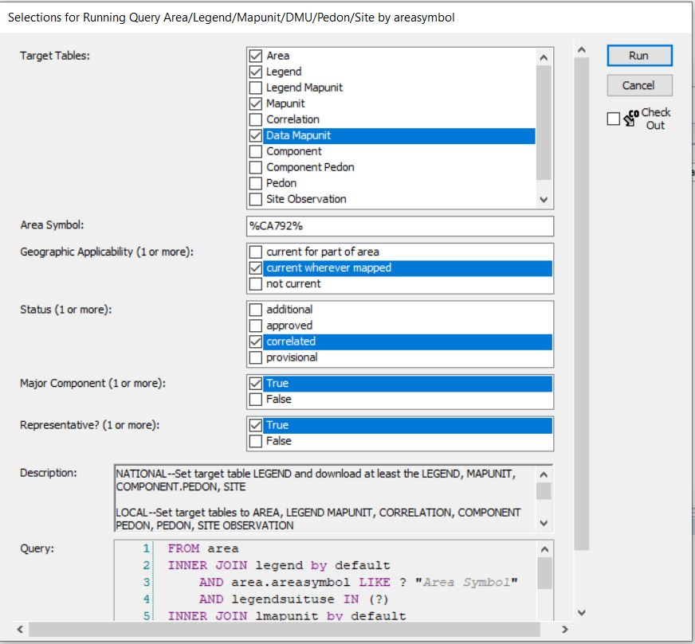

# Components

```{r, echo=FALSE, message=FALSE, warning=FALSE}
library(soilDB)
library(dplyr)
library(aqp)
library(sf)
library(stringr)
library(ggplot2)
library(maps)
```

The concept of map units and map unit components is essential to understand for ecological site work. Map units are associated with landforms, though this is not explicitly stated in the map unit section of the Soil Survey Manual. Examples of landforms that map units might be associated with in a mountain landscape could include, north-facing backslopes of mountains, .....  Map units are spatially explicit - they are delineated as polygons on a map. Often times, map units have multiple delineations. For example, the same map unit - let's call it Map Unit #1 - can appear multiple times on your soil map. Despite having separate delineations, all of the delineations are the same map unit - Map Unit #1. 

Map units have one, or more, map unit components. Map unit components, or simply - components, partition map units into areas with different properties. Examples of properties that may differ include, family particle size class, depth to restriction, drainage class, surface fragments, and others. Typically, component within a map unit will not differ based on elevation or slope. Elevation and slope contribute towards the landform and therefore significant differences would justify creating a separate map unit. Components are not spatially explicit, there are not polygons on a map showing the spatial location of components. Components should be identifiable in the field, though. For example, if you know you are within a map unit (check to see if you are within the map unit polygon), you should be able to distinguish between the possible components of that map unit. For example, a map unit may have two components - Component A and Component B. Component A has higher surface fragments than Component B. Therefore, to determine if a specific location within your map unit of interest is Component A or B, you would examine the amount of surface fragments. Though components are not spatially explicit, a component percent is assigned. The component percent describes the percentage of the map unit that the component is expected to occupy. For example, a component percent of 40 would mean that 40% of the map unit is expected to be associated with that component. Given that map units have a defined acreage, you can determine the number of acres associated with each component by multiplying the map unit acreage times the component percent. If a map unit has a total acreage of 500,000 acres and the Component A has a component percent of 60, than there are 300,000 acres of Component A. A component should appear in all delineations of a map unit. If Component A and Component B are part of Map Unit #1, they should appear in all delineations. Technically, they should appear in the same proportions. For example, if Component A has a component percent of 60, 60% of the acreage of all map unit delineations should be Component A. In practice, this is often not the case. Components appear in different map unit delineations in different proportions. Just as the separate map unit delineations are the same map unit - Map Unit #1, the components appearing in each delineation are considered the same component. No matter how many delineations of Map Unit #1 there are, they are all Map Unit #1 every time Component A appears in each delineation, it is still Component A. There are several structures for naming map units in NASIS, including mukey, musym, muiid. A common way of identifying map units is using mukey. The common way of identifying component is coiid. This is unique identifier for components. Each component has a unique coiid. Ultimately, it is the coiid that an ecological site is correlated to. Components also have a component name. The component name can be a soil series or a higher soil taxonomic class, such as family. Component names are not unique to components. If multiple components are associated with the same soil series, than those components will all have the same component name. For example, if Component A from Map Unit #1 and a different component - Component Z from Map Unit #9 - are both associated with the soil series, Turney, than Component A and Component Z will both have the component name, Turney. Some areas of country require all components with the same component name to be correlated to the same ecological site. This would mean that Component A and Component Z must be correlated to the same ecological site. Component phases are a way of distinguishing that two components with the same component name differ in some condition. Various descriptors can be used to phase a component, such as cool, warm, steep - any modifier that describes how the component is different from other components with the same name. Often times, phases are used as justification for components with the same component name being correlated to different ecological sites. 


Ecological sites, are correlated to th


Depending on the order of the soil survey, components may be associated with soil series or high taxa, such as family. 


are one of the core concepts in the NRCS ecological workflow. Ecosites are correlated to components. Components are part of 

Often times we will access component level data using a query and then the fetchNASIS function. One of the fetchNASIS arguments is duplicates. This argument helps to deal with the fact that components (coiids) can be associated with multiple legends. In the vast majority of cases, a component being associated with multiple legends is the result of a MLRA mapunit. An MLRA mapunit uses the same data mapunit across survey boundaries. MLRA mapunits are increasingly popular because they allow mapunits to span larger, environmentally contiguous areas, like MLRAs, rather than being restricted to political or administrative boundaries, like counties and soil survey areas. As a result, a component (coiid) can be associate with multiple legends. By default (duplicates = FALSE), fetchNASIS outputs a single instance for each component and does not include legend level information, such as areasymbol, mukey, muacres, etc. To include legend level information, you must duplicate (duplicates = TRUE) the components, or report each component multiple times if it exists in multiple legends. If duplicates = TRUE, components will be listed for every time they are used in a different legend. If a component is used in four legends, it will be listed four times. When components are duplicated, each instance is associated with a particular legend, therefore the specific legend information will be included. The full list of additional variables that will be include is: coiidcmb, muiid, lmapunitiid, mukey, musym, nationalmusym, muname, mukind, mutype, mustatus, muacres, farmlndcl, repdmu, areasymbol, areaname, ssastatus, cordate.

## Identify components in MLRA? {#componentsinMLRA}
There are NASIS Queries that allow querying by MLRA. Unfortunately, this is not the best approach. See the section [What mapunits are in an MLRA](#mapunitsinMLRA) for an explanation of why. Spatial intersection of MLRA boundaries and mapunits is more reliable. 

1. Determine the mapunits in the MLRA using the [Mapunits in MLRA tool](#mapunitsinMLRA)
2. Take the group of mapunits and enter them into Query > MLRA09_Temple > ARE/LMU/MU/DMU by Lmukey list.

Run against National Database:


Run against Local: 


3. Acquire the component names and component IDs using R:

Load the soilDB package and fetch NASIS data
```{r, eval=FALSE}
library(soilDB)
my.components.MLRA <- fetchNASIS(from = "components", duplicates = TRUE)
```


```{r, echo=FALSE, message=FALSE, warning=FALSE}
my.components.MLRA <- fetchNASIS(from = "components", dsn = "C:/Users/Nathan.Roe/Documents/ESS-FAQ/data/Loafercreek_mapunit.sqlite", SS = FALSE,
                                 duplicates = TRUE)
```


Look at component names - the ```head()``` function shows just the first six records. Remove the ```head()``` function to see all the component names
```{r}
head(my.components.MLRA$compname)
```

Look at the component IDs
```{r}
head(site(my.components.MLRA)$coiid)
```


## Identify components in Soil Survey Area?

Queries by Soil Survey Area are much more reliable than queries by MLRA. As previously mentioned, queries by MLRA are not ideal because the mapunit overlap tables are imperfectly populated. The Soil Survey area corresponds to the legend, and this means that components are reliably associated with Soil Survey Areas. Therefore, beginning with a query is the preferred approach:

1. Run against National


2. Run against Local


3. Acquire component names and IDs using R. 

Load the soilDB package and fetch NASIS data
```{r, eval=FALSE}
library(soilDB)
my.components.SSA <- fetchNASIS(from = "components", duplicates = TRUE)
```


```{r, echo=FALSE, message=FALSE}
library(soilDB)
my.components.SSA <- my.components.MLRA
```

Look at component names - the ```head()``` function shows just the first six records. Remove the ```head()``` function to see all the component names
```{r}
head(my.components.SSA$compname)
```

Look at the component IDs
```{r}
head(my.components.SSA$coiid)
```

## Existing component, ecosite correlations
Perhaps we want to see what ecosite each component is correlated to. For this example, we will work with all the components in MLRA 18 using the [Standard Dataset and packages](#standard).

With the Standard Dataset loaded, let's look at the correlations between component ID and ecosite ID. This script takes our components in MLRA 18, pulls out the site level data (allows us to ignore pedon data), and then selects only the columns for component ID and ecosite ID (there are lots of other columns you can choose from, tailor to your needs). Finally we look at just the ```head()``` of the ```comp.ecosite.correlations```. If you want to see the full dataframe, remove ```head()```. 
```{r}
comp.ecosite.correlations <- my.components.MLRA %>% aqp::site() %>% 
  dplyr::select(coiid, ecositeid)

head(comp.ecosite.correlations)
```

## Components correlated to an ecosite of interest?
Perhaps there is a specific ecosite we are interested in and we want to see what components are correlated to that ecosite. Let's say the ecosite is ```R018XI201CA```. We will start with the ```comp.ecosite.correlations``` dataframe that we created in the previous example. 

```{r}
R018XI202CA <- comp.ecosite.correlations %>% filter(ecositeid == "F018XA201CA")
head(R018XI202CA) # Again, remove head() to see the full list. 
```


## Ecological characteristics of components? (non-programmatic)

One of the best ways to do this is a NASIS report: NASIS > Reports > MLRA02_Davis > EXPORT - Ecological site concept data by MUKEY list v3. This report takes mapunit keys (MUKEY) as input. If you are interested in all the components in an MLRA, refer to [What mapunits are in an MLRA?](#mapunitsinMLRA). If you are interested in a Soil Survey Area ...... 

1. Run against National

2. In the resulting output (html output in your browser), click anywhere, ctrl + a (select all), ctrl + c (copy)
3. Open Excel, click in top left cell, ctrl + v (paste)
4. Ctrl + a (select all), Insert > Table

Now you have a table with lots of ecological characteristics. You can use the column headers to filter in various ways. If you prefer to work in R, save this file as a .csv and read it into R. 

## Ecological characteristics of components? (programmatic)

Load the [Standard Dataset and packages](#standard).

Let's start off by removing miscellaneous areas and minor components. This is 
going to simplify things and remove some of the oddities that may exist in the 
data. Ecological sciences do not correlate to misc. areas or minor components, 
so it will not be a loss to us. 

```{r}
nasis_selection <- subset(my.components.MLRA, compkind != "miscellaneous area" &
                            majcompflag == "1")
```


***Horizon level data***

Create data frame from the horizon level data. This script provides
the flexibility to add characteristics of interest. If there are other
horizon level data that you are interested in, you can add it following
the same syntax shown below. To see what horizon level data is available, 
type 'nasis_selection@horizons$' into the console. Horizon level data is 
summarized into site level info. If you add other horizon level data, make 
sure it is summarized in a conceptually meaningful way. 

```{r}
horizon_df <- data.frame(texture = nasis_selection$texture,
                         frag_vol = nasis_selection$fragvoltot_r,
                         sand = nasis_selection$sandtotal_r,
                         clay = nasis_selection$claytotal_r,
                         sieve10 = nasis_selection$sieveno10_r,
                         thickness = nasis_selection$hzdepb_r - nasis_selection$hzdept_r,
                         rock_frag = nasis_selection$total_frags_pct,
                         ph_l = nasis_selection$ph1to1h2o_l,
                         ph_r = nasis_selection$ph1to1h2o_r,
                         ph_h = nasis_selection$ph1to1h2o_h,
                         awc_l = nasis_selection$awc_l,
                         awc_r = nasis_selection$awc_r,
                         awc_h = nasis_selection$awc_h,
                         coiidcmb = nasis_selection$coiidcmb) %>% left_join(site(nasis_selection) %>% dplyr::select(coiidcmb, coiid)) %>% 
                                                                  select(-coiidcmb) %>% dplyr::rename(component = coiid)
```

Separate the texture column
```{r}
horizon_df$texture_qualifier <- horizon_df$texture %>% stringr::str_extract(".*(?=-)")
horizon_df$texture_only <- horizon_df$texture %>% stringr::str_extract("(?<=-).*")
horizon_df$texture_only <- ifelse(is.na(horizon_df$texture_only), horizon_df$texture, 
                                  horizon_df$texture_only)
```

Working with texture:

We have two goals for texture. One, we want to have a textural modifier where
appropriate (i.e., CB, CBV, GR). Two, we want to have a texture (i.e., L, CL, 
SC). Ultimately, we want a single textural modifier and a single texture to 
represent the entire soil profile. We are starting off with textural modifiers
and textures for each horizon, though. Therefore, we need to consider how to 
aggregate that data. 

Textural modifiers - 

For textural modifiers, we will choose the textural modifier from the thickest
soil horizon and that textural modifier will be used as a value that represents
the entire profile. 

Before doing that, we are going to change the depth of horizons that were 
not textured. For those horizons that were not textured, we are going to 
change the depth to 0.1 cm. This will prevent textural modifiers from being
defined based on a horizon that was not textured. For example, a BR horizon
is automatically assigned a depth of 25 cm. Depth of BR has limited 
ecological significance, and we do not want the texture of the soil profile 
to be determined by BR conditions. We are also specifically stating that
texture is not equal to "BR" because several horizons that are BR have
values of 0 for sand and clay when they should be NAs. 
```{r}
horizon_df$thickness_modified <- ifelse(is.na(horizon_df$clay), 0.1, 
                                        ifelse(horizon_df$texture == "BR", 
                                        0.1, horizon_df$thickness))
```

Now, we assign the textural modifier from the thickest horizon to the component.
```{r, message=FALSE}
summarized_texture_qualifier <- horizon_df %>% 
  dplyr::group_by(component, texture_qualifier) %>% 
  dplyr::summarize(combined_thickness = sum(thickness_modified)) %>%
  dplyr::ungroup() %>% 
  dplyr::group_by(component) %>% 
  top_n(1, combined_thickness) %>% ungroup() %>% 
  dplyr::select(-combined_thickness) 
```
Texture - 

Now, we are going to assign a texture to the entire profile. For texture, we
have quantitative data (sand and clay percentages). This allows us to do a 
weighted average rather than just choosing the texture from the thickest horizon
like we did for texture modifiers. 

First, we will remove horizons that do not have textures. We will also remove 
horizons labelled with texture as "BR" because some of those bedrock horizons
have sand and clay percentages entered as zero rather than NA. Then, we group the
horizons by the component id and calculate a weighted mean for clay/sand, pH, and
rock frag using the horizon thickness as the weighting. 
```{r}
weighted_texture <- horizon_df %>%
  dplyr::filter(!is.na(clay) & !is.na(sand) & texture != "BR") %>%
  dplyr::group_by(component) %>%
  dplyr::summarise(clay_mean_texture = weighted.mean(clay, thickness_modified),
                   sand_mean_texture = weighted.mean(sand, thickness_modified),
                   ph_l_mean = weighted.mean(ph_l, thickness_modified),
                   ph_r_mean = weighted.mean(ph_r, thickness_modified),
                   ph_h_mean = weighted.mean(ph_h, thickness_modified),
                   awc_l_sum = sum(awc_l * thickness_modified),
                   awc_r_sum = sum(awc_r * thickness_modified),
                   awc_h_sum = sum(awc_h * thickness_modified),
                   rock_frag = weighted.mean(rock_frag, thickness_modified),
                   depth_to_restr = sum(thickness_modified)) %>%
  dplyr::mutate(textural_class = aqp::ssc_to_texcl(clay = clay_mean_texture,
                                                   sand = sand_mean_texture))
```

Combine the texture qualifiers and the textures into a dataframe
```{r, message=FALSE}
horizon_to_component_data <- dplyr::left_join(summarized_texture_qualifier, weighted_texture)
```

***Component level data***

Here, we change gears and start assembling component level data. 
```{r}
component_data <-
  with(site(nasis_selection),
       data.frame(
         coiid = coiid,
         compname = compname,
         compkind = compkind,
         areasymbol = areasymbol,
         areaname = areaname,
         comppct_r = comppct_r,
         slope_l = slope_l,
         slope_r = slope_r,
         slope_h = slope_h,
         majcompflag = majcompflag,
         pmkind = pmkind,
         dmuiid = dmuiid,
         pmorigin = pmorigin,
         surf_frag = surface_total_frags_pct,
         elev_l = elev_l,
         elev_rv = elev_r,
         elev_h = elev_h,
         map_l = map_l,
         map_rv = map_r,
         map_h = map_h,
         maat_l = maat_l,
         maat_rv = maat_r,
         maat_h = maat_h,
         ffd_l = ffd_l,
         ffd_rv = ffd_r,
         ffd_h = ffd_h,
         aspectccwise = aspectccwise,
         aspectrep = aspectrep,
         aspectcwise = aspectcwise,
         landform = landform_string,
         taxtemp = taxtempregime,
         drainagecl = drainagecl,
         ecosite = ecosite_name,
         ecositeid = ecositeid,
         taxorder = taxorder,
         taxsuborder = taxsuborder
       )
  )
```

Collect restriction data
```{r, message=FALSE}
restriction_data <- restrictions(nasis_selection) %>%
  dplyr::select(coiid, reskind, resdept_l, resdept_r, resdept_h, reshard) %>%
  subset(!grepl("noncemented", reshard)) %>%
  dplyr::group_by(coiid) %>%
  arrange(resdept_r) %>%
  dplyr::slice(1)
```

Merge component data and restriction data
```{r}
component_data_combined <- left_join(component_data, restriction_data)
```

***Merge horizon data and component data***
```{r, message=FALSE}
all_data <- horizon_to_component_data %>%
  dplyr::rename(coiid = component) %>%
  left_join(component_data_combined) %>%
  dplyr::select(coiid,  compname, ecosite, ecositeid, landform, pmkind, 
                pmorigin, taxtemp, textural_class, texture_qualifier, 
                rock_frag, surf_frag, depth_to_restr, drainagecl, slope_l, 
                slope_r, slope_h, ph_l_mean, ph_r_mean, ph_h_mean, elev_l, 
                elev_rv, elev_h, map_l, map_rv, map_h, maat_l, maat_rv, 
                maat_h, ffd_l, ffd_rv, ffd_h ,comppct_r, dmuiid, 
                everything())
```

Save as csv
```{r, eval = FALSE}
write.csv(all_data, "C:/Users/Nathan.Roe/Downloads/my_ecosite_report.csv",
          row.names = FALSE)
```

## Where do components occur?

## How to correlate components to ecosites?

## How to QC the correlation between 

## Test section
