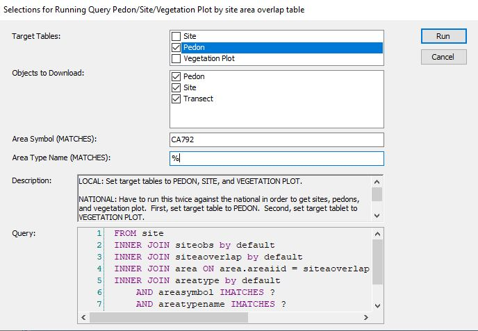
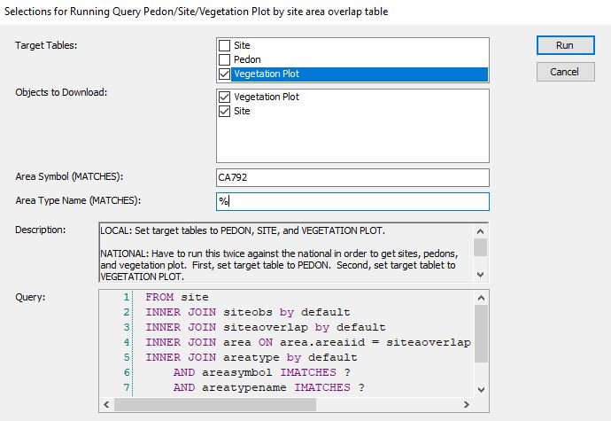
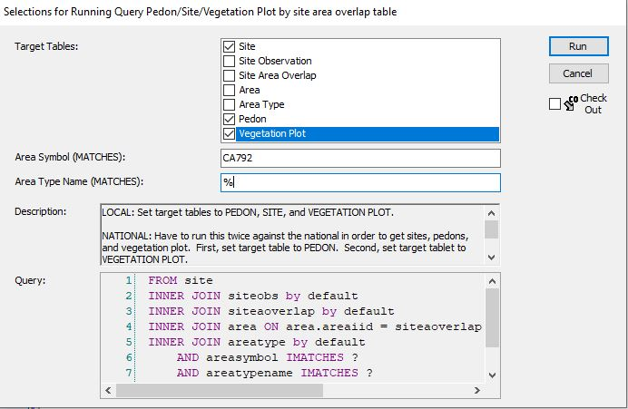

# Ecosites

```{r, echo=FALSE, message=FALSE, warning=FALSE}
my.components.MLRA <- fetchNASIS(from = "components", duplicates = T, dsn = "C:/Users/Nathan.Roe/Documents/ESS-FAQ/data/Loafercreek_mapunit.sqlite", SS = FALSE)
```

```{r, echo=FALSE, message=FALSE, warning=FALSE}
library(soilDB)
library(dplyr)
library(aqp)
library(sf)
library(stringr)
library(ggplot2)
library(maps)
library(tibble)
```

## What ecosites are active in an MLRA?

Load the [Standard Dataset and packages](#standard).

Then, we simply need to call the ecosite IDs or ecosite names, depending on your preference. Remember, remove ```head()``` to see the full list. 
```{r}
head(my.components.MLRA$ecosite_id)
head(my.components.MLRA$ecosite_name)
```

There are likely NAs (missing values) in the above list. This is because the above considers components are are minor and miscellaneous. We do not correlate ecosites to components that are minor and miscellaneous. It will likely be more useful to remove minor and miscellaneous componets: 

```{r}
my.components.MLRA.reduced <- my.components.MLRA %>% aqp::site() %>% 
  filter(compkind != "miscellaneous area" & majcompflag == "1")
head(my.components.MLRA.reduced$ecosite_id)
head(my.components.MLRA.reduced$ecosite_name)
```

We might also be interested to see how often different ecosites are used:
```{r}
table(my.components.MLRA.reduced$ecosite_id) %>% as.data.frame() %>% 
  dplyr::rename(Ecosite = Var1) %>% arrange(desc(Freq)) %>% head()
```

Interesting... the most used ecosites in MLRA18 are ecosite concepts from MLRAs 22a and 17. 

## Range in characteristics of ecosites
I created a report that summarizes the characteristics of ecosites. It is organized based on the information that is supposed to be populated in EDIT. Here is a link to a [sample report](https://htmlpreview.github.io/?https://github.com/natearoe/practice/blob/master/F018XA201CA.html). I have established a methodology allowing you to create reports like the one linked for all of the ecosites in your MLRA within a few short steps. You can also produce the report for just one of your ecosites. For documentation on this methodology, [click here](https://natearoe.github.io/git-cloud-storage/read_me.docx). Click on the green 'Code' button and choose 'Download ZIP'. Once you have downloaded to the location of your preference, you can right click > Extract all. You can then open the read_me.docx file. Additionally, you can watch the following YouTube video:

```{r, echo=FALSE}
knitr::include_url("https://www.youtube.com/embed/9H8sz5fZaEQ?start=19")
```

## Mapping ecological sites

For this methodology, the ecological site is mapped in all map units containing a component correlated to the ecological site. The alternative would be to map the ecological site only in map units where the dominant component is correlated to the ecological site of interest. I am more interest in the full extent of the ecological site, so I am using the less restrictive of the two. 

Load the [Standard Dataset and packages](#standard).

Load a shapefile of your map unit boundaries (the MLRA boundaries cover the whole country, but you will have to change the map unit boundaries to your local map unit shapefile)
```{r, message=FALSE, warning=FALSE}
mapunit_boundaries <- sf::read_sf("C:/Users/Nathan.Roe/Documents/PES/gSSURGO_CA_2022.gdb",
                                  "mupolygon")
mlra_boundaries <- 
  sf::read_sf("C:/Users/Nathan.Roe/Documents/PES/MLRA_52_2022/MLRA_52_2022/MLRA_52.shp")
```

What is your ecological site of interest? (change appropriate to your project)
```{r}
ecosite_of_interest <- "R018XE104CA"
```

What is your MLRA of interest? (change appropriate to your project)
```{r}
mlra_of_interest <- 18
```

Reduce component data to those associated with ecosite of interest
```{r}
my.components.MLRA.reduced <- aqp::site(my.components.MLRA) %>% 
  filter(ecosite_id == ecosite_of_interest)
```

Reduce mapunits to those associated with ecosite of interest
```{r}
mapunit_boundaries_of_interest <- mapunit_boundaries %>% 
  dplyr::filter(MUKEY %in% my.components.MLRA.reduced$muiid) %>% 
  sf::st_transform("+proj=longlat +datum=WGS84")
```

Reduce MLRA boundary to MLRA of interest
```{r}
mlra_boundaries_reduced <- mlra_boundaries %>% 
  dplyr::filter(MLRARSYM == mlra_of_interest) %>% 
  sf::st_transform("+proj=longlat +datum=WGS84")

```

Select state of interest (change appropriate to your project, you could select multiple states too)
```{r}
ca <- st_as_sf(maps::map("state", fill = TRUE, plot = FALSE)) %>% 
  dplyr::filter(ID == "california") %>% 
  sf::st_transform("+proj=longlat +datum=WGS84")
```

Plot map
```{r}
ggplot() + theme_minimal() +  geom_sf(data = ca) + 
  geom_sf(data = mlra_boundaries_reduced) + 
  geom_sf(data = mapunit_boundaries_of_interest,
          col = "hotpink", alpha = 0, size = 2) + 
  ggtitle(paste0("Distribution of ecological site - ", ecosite_of_interest))
```

## Climate
At a large scale, climate is the most important abiotic variable affecting the distribution of organisms. In ecological site concept development, it is a critical starting place. This section will introduce functions that can help report the climate associated with an ecoligcal site by summarizing PRISM climate data (https://prism.oregonstate.edu/). PRISM data is 800m raster data that includes precipitation, temperature, vapor pressure, and dew point. 

The primary product of PRISM is climate normals. PRISM normals are averages of climate conditions across a 30-year time frame. There are annual normals, monthly normals, and daily normals. There are 365 daily normals (one for each day), 12 monthly normals (one for each month), and only one annual normal. As an example of how normals work, consider precipitation on the 12th day of the year across the time period 1991-2020. There are 30 years of data, each with a 12th day and an associated estimate of precipitation. Those 30 estimates are averaged. The result is the daily normal for the 12th day of the year. The same process can be applied for the other days of the year.

```{r}

```


## Associated sites
Associated sites are ecological sites that occur in the same area of the landscape. The simplest way to think about this is ecological sites that are adjacent to your ecological site of interest. I am going to present a simple way of addressing this. We can determine what ecological sites occur in the same mapunit as your ecosite of interest. Looking at all the mapunits that your ecological site of interest occurs in, and tallying up all of the other ecological sites that are in shared mapunits, we can come to a metric of what other ecological sites tend to be near your ecological site of interest. In the future, I would like to make some improvements to this, so that it considers adjacent mapunits and considers the length of boundary between mapunits. 

Load the [Standard Dataset and packages](#standard).

Reduce data how you see fit. I am just going to remove miscellaneous areas, but you could choose additional criteria such as removing minor components. 
```{r}
my.components.MLRA.reduced <- my.components.MLRA@site |> dplyr::filter(compkind != "miscellaneous area")
```

Calculate the acreage associated with each component
```{r}
my.components.MLRA.reduced$comp_acres <- (my.components.MLRA.reduced$muacres * my.components.MLRA.reduced$comppct_r)/100
```

Create empty list for upcoming for loop
```{r}
associated_ecosites <- list()
```

Create for loop to calculate the acreage of ecosites that occur in the same mapunits as your ecosite of interest. The results will be in a list. 
```{r}
for(i in my.components.MLRA.reduced$ecosite_id |> unique()){
  associated_ecosites[[i]] <- my.components.MLRA.reduced |> 
    dplyr::filter(mukey %in% (my.components.MLRA.reduced |> 
                    dplyr::filter(ecosite_id == i) |> 
                    dplyr::pull(mukey))) |> 
    dplyr::group_by(ecosite_id) |> dplyr::summarise(acres = sum(comp_acres)) |> 
    dplyr::filter(ecosite_id != i) |> arrange(dplyr::desc(acres))
}
```

Let's take a look at an example
```{r}
associated_ecosites$F018XA202CA
```

## Determine acreage of single ecological site

My office leader recently asked me how many acres a particular ecological site occupies because she was entering it as a project in NASIS and needed the associated acres. You might need to do something similar for a NASIS project, a tech team meeting, or to improve your own understanding of how prevalent an ecological site is. 

Load the [Standard Dataset and packages](#standard).

First, let's say we have a particular ecosite of interest - "R018XI105CA" 
```{r}
my_ecosite <- aqp::site(my.components.MLRA) %>% dplyr::filter(ecosite_id == "R018XI105CA")
```

Now let's look at the components correlated to our ecosite of interest, the component percent (percent of mapunit represented by component), the mapunit acres, and calculate the acres associated with each component by multiplying component percent and mapunit acres. 
```{r}
my_ecosite_compacres <- my_ecosite %>% select(ecosite_id, coiid, comppct_r, muacres) %>% mutate(comp_acreage = (comppct_r/100)*muacres)

head(my_ecosite_compacres)
```

Then, we just need to sum the comp_acreage
```{r}
sum(my_ecosite_compacres$comp_acreage)
```
## Determine acreage of multiple ecological sites

Let's look at how we would efficiently calculate the acreage of all the ecosites in your MLRA. 

First, we will restrict the ecosites of interest to only those associate with MLRA 18. 
```{r}
MLRA18_ecosites <- my.components.MLRA$ecosite_id %>% str_subset(pattern = "18X") %>% unique()
```

Now we can run a for loop that goes through each ecological site, calculates the acreage, and puts them all in a data frame
```{r}

ecosite_list <- list()

for(i in MLRA18_ecosites){
  ecosite_list[[i]] <- aqp::site(my.components.MLRA) %>% dplyr::filter(ecosite_id == i) %>% select(ecosite_id, coiid, comppct_r, muacres) %>%
                                              mutate(comp_acreage = (comppct_r/100)*muacres) %>% summarise(Ecosite = first(ecosite_id), Acreage =
                                                                                                           sum(comp_acreage))
}

MLRA18_ecosite_acreage <- do.call(rbind, ecosite_list) %>% remove_rownames()

head(MLRA18_ecosite_acreage)
```

## Accessing plot level vegetation data{#plotveg}

For this process, we are going to look at vegetation data associated with the Sequoia and King's Canyon National Parks soil survey - CA792. For accessing vegetation data associated with a survey area, use the following query -  SSRO_Alaska > 'Pedon/Site/Vegetation Plot by site area overlap table'. The description for this Query gives the necessary details. 

NATIONAL: Have to run this twice against the national in order to get sites, pedons, and vegetation plot.  First, set target table to PEDON.  Second, set target tablet to VEGETATION PLOT.

LOCAL: Set target tablest to PEDON, SITE, and VEGETATION PLOT.

1. Run against National - Pedon


2. Run against National - Vegetation plot


3. Run against Local


```{r, echo=FALSE, message=FALSE, warning=FALSE}
veg_data <- soilDB::fetchVegdata(dsn = "C:/Users/Nathan.Roe/Documents/SEKI/CA792_veg_data.sqlite", SS = FALSE)
```

```{r, eval=FALSE}
veg_data <- soilDB::fetchVegdata(SS = TRUE)
```

I will return to this to provide some tools for dealing with the actual veg data. 

```{r}
test <- data.frame(UserSiteID = veg_data$vegplot$site_id, DataOrigin = veg_data$vegplot$vegdataorigin)

table(test$DataOrigin)
```


