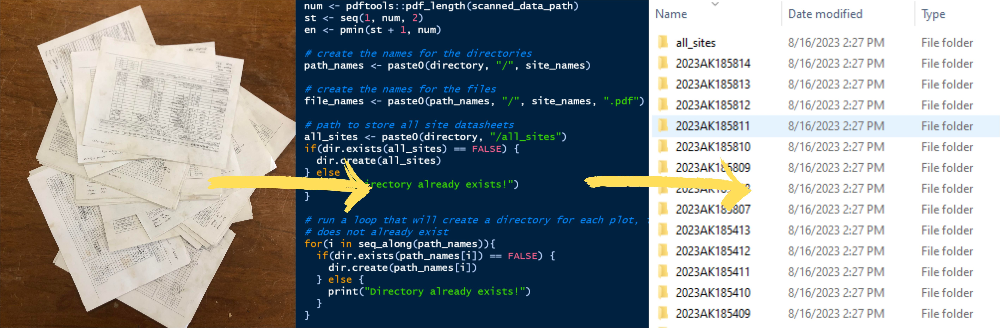

# Random tools

## Organizing scanned data

```{r, echo=FALSE}

```


Digitizing and organizing datasheets can be tedious. The following workflow automates this process, removing the need to create/name folders, name files, scan documents individually (or manually separate), and sort files into the appropriate folder. Instead, you can bulk scan (feed your whole stack to the scanner at once) and create a single pdf file. Then, using R we will separate that file into individual pdfs, one pdf for each site. Each pdf will be named using the site id and put in a folder using the same site id. Let's go over the steps - 

1. Organize your paper datasheets in numerical order
2. Scan your paper datasheets using the office scanner. You should be able to feed all of the datasheets in at once. The result is a single pdf file with all of your sites.
3. Determine the site numbers. This step requires either extracting the site numbers from a GPS device, NASIS, or some other source OR typing the site numbers manually. Typing the site numbers manually would look like this:
```{r}
my_site_number <- c(401, 402, 403, 404, 405)
```

Depending on what you have available and your skillset (willing to use soilDB to pull sites/pedons under your name in NASIS, etc.), you may have to enter this manually. Fortunately, this will be the only manual part of the workflow.  

4. Install the ecositer R package
```{r, eval=FALSE}
remotes::install_github("natearoe/ecositer", dependencies = FALSE)
```

5. Look at the help file for the scanned_data_organizer() function in R
```{r, eval=FALSE}
?ecositer::scanned_data_organizer()
```

6. Run scanned data_organizer(). Remember that your paths need to have forward slashes, not back slashes. That'll be a show stopper. I do find and replace all. Also, make sure you have created a vector of site numbers, that needs to be called in the site_number argument. 

Here is an example of running scanned_data_organizer():
```{r, eval=FALSE}
ecositer::scanned_data_organizer(scanned_data_path = "S:/NRCS/XEROX SCANS/DOC057.pdf",
directory = "C:/Users/Nathan.Roe/Documents/Alaska2023/Willow_project",
year_state_fips = "2023AK185",
site_number = my_site_number)
```

That's it! You now have a folder for each site that contains a pdf of that site's datasheet. There is also an all_sites folder containing all of the site pdfs together in one location.

## Comparing Bray-Curtis and Jaccard (dis)similarity measures

Bray-Curtis (similarity): $\frac{2 * A \cap B}{\left(A \cap B\right) + \left(A \cup B\right)}$

Bray-Curtis (dissimilarity): $1 - \frac{2 * A \cap B}{\left(A \cap B\right) + \left(A \cup B\right)}$


Jaccard (similarity): $\frac{A \cap B}{A \cup B}$

Jaccard (dissimilarity): $1 - \frac{A \cap B}{A \cup B}$

Both Bray-Curtis and Jaccard are proportional coefficients that express the proportion of the maximum distance possible. The numerators of Bray-Curtis and Jaccard, measures of shared abundance, are relativized by total abundance or unshared abundance, respectively. The numerators are essential the same, both being directly related to $A \cap B$ (hereon referred to as shared abundance).

Given that shared abundance drives both measures, I propose examining the response of both measures along a gradient of shared abundance. The gradient of shared abundance will vary from 0 to 1. The total abundance will remain fixed at 1. 

Simulate shared abundance and calculate both measures
```{r}
# create a gradient of proportion shared abundance
prop_sim <- matrix(data = seq(0, 1, 0.01))

# calculate bray
bray <- apply(prop_sim, MARGIN = 2, FUN = function(x){
  x/1 # "1" could also be max(x)
})

# calculate jaccard
jaccard <- apply(prop_sim, MARGIN = 2, FUN = function(x){
  0.5*x/(1 - 0.5*x) # "1" could also be max(x) 
})

# put results in dataframe
my_results <- data.frame(prop_sim = prop_sim,
                         bray = bray,
                         jaccard = jaccard)

# calculate difference between bray and jaccard
my_results$diff <- abs(my_results$bray - my_results$jaccard)

# calculate dissimilarities
my_results$bray_dis <- 1 - my_results$bray
my_results$jaccard_dis <- 1 - my_results$jaccard
```

Plot the relationship between Bray-Curtis and Jaccard
```{r, warning=FALSE}
my_results_long <- tidyr::pivot_longer(my_results, cols = c("bray", "jaccard", "bray_dis", "jaccard_dis"))

my_results_long$type <- ifelse(grepl("dis", my_results_long$name) == TRUE, "Dissimilarity", "Similarity")

my_colors <- c("#999999")

ggplot2::ggplot(data = my_results_long, 
                ggplot2::aes(x = prop_sim,
                             y = value,
                             color = name)) +
  ggplot2::geom_path(size = 1) +
  ggplot2::xlab("Shared abundance") +
  ggplot2::ylab("Value") +
  ggplot2::labs(color = "Measure") +
  ggplot2::scale_color_manual(labels = c("Bray-Curtis (sim)",
                                         "Bray-Curtis (dis)",
                                         "Jaccard (sim)",
                                         "Jaccard (dis)"),
                              values = c("#F8766D", "#7CAE00",
                                         "#00BFC4", "#C77CFF"))
  
```

Bray-Curtis is linear with a slope of 1 or -1. Jaccard is non-linear. To determine how the slope of Jaccard changes over a gradient of shared abundance, I will differentiate Jaccard (sim). 
```{r}
my_results$jaccard_deriv <- apply(prop_sim, MARGIN = 2, FUN = function(x){
  0.5/(1-.5*x)^2
})


ggplot2::ggplot(data = my_results, 
                ggplot2::aes(x = prop_sim,
                             y = jaccard_deriv)) +
  ggplot2::geom_path(size = 1) +
  ggplot2::xlab("Shared abundance") +
  ggplot2::ylab("1st derivative of Jaccard similarity")
```

The derivative of Jaccard (sim) shows us that changes to shared abundance at low levels of shared abundance have 1/4 of the influence as changes to shared abundance at high levels of shared abundance. This is observable from the 1st derivative being 0.5 at low levels of shared abundance and 2 at high levels of shared abundance. This could be a useful property if low amounts of shared abundance could be considered spurious. 

Finally, let's look at disagreement between Jaccard and Bray-Curtis. 
```{r}
ggplot2::ggplot(data = my_results,
                ggplot2::aes(x = prop_sim, y = diff)) +
  ggplot2::geom_path(size = 1) +
  ggplot2::xlab("Shared abundance") +
  ggplot2::ylab("Abs. value diff. of Bray-Curtis and Jaccard")
```

```{r}
my_results |> dplyr::select(prop_sim, diff) |> dplyr::arrange(desc(diff)) |> head()
```

The greatest disagreement occurs at a shared abundance of 0.59. Above a shared abundance of 0.59, Jaccard accelerates, converging with Bray-Curtis at a share abundance of 1 in a shared abundance distance of 0.41. Below a shared abundance of 0.59, Jaccard takes longer to converge with Bray-Curtis, converging at 0 in a shared abundance distance of 0.59. This trend is consistent with the accelerating slope of Jaccard. 

In summary, Bray-Curtis treats changes to shared abundance as a linear function. Any change in shared abundance has equal importance across a gradient of shared abundance. In fact, the shared abundance value used in this comparison is in essence Bray-Curtis itself. Alternatively, Jaccard considers changes to shared abundance at low levels of shared abundance to be less important than changes at high levels of shared abundance. Basically, low levels of shared abundance are considered more spurious than high levels. There are several reasons why this may be true, including accounting for shared abundance between ubiquitous, cosmopolitan species in otherwise dissimilar plots or having shared abundance in dissimilar plots due to a misidentified species. 

```

