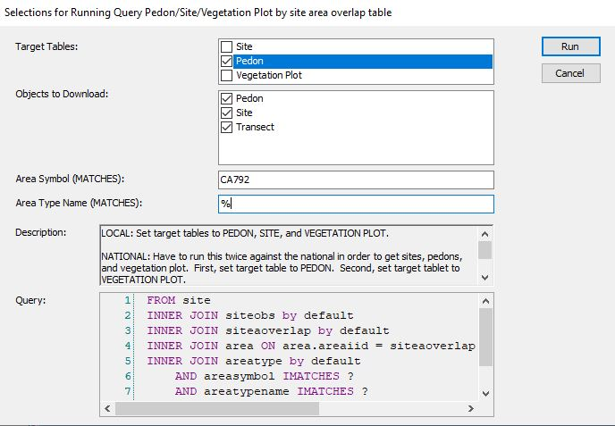
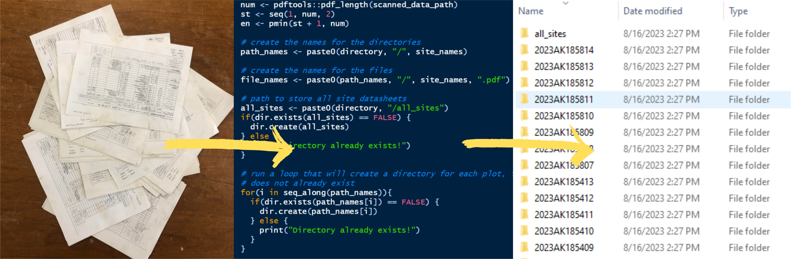

--- 
title: "NRCS Ecologist FAQs"
author: "Nathan Roe - nateroe@gmail.com"
date: "`r Sys.Date()`"
site: bookdown::bookdown_site
documentclass: book
bibliography: [book.bib, packages.bib]
# url: your book url like https://bookdown.org/yihui/bookdown
# cover-image: path to the social sharing image like images/cover.jpg
description: |
  This is a compilation of FAQs for NRCS Ecologists.
link-citations: yes
github-repo: rstudio/bookdown-demo
---

# Introduction

This documents outlines common methodologies used by NRCS Ecologists. It is intended to be an educational resource and to develop best practice standards. This is intended to be a living document. If you have recommendations for best practices or additional practices that should be added, please let me know!

## Overview 

This document is divided into 4 sections: mapunits, components, plots, and ecosites. Within those sections are commonly used methodologies relating to the section concept. For example, within the components section are methodologies relating to the use of components (i.e., What are the ecological characteristics of components?). 

Much of this methodology relies on a combination of NASIS and R. It is my objective to make the R examples clear enough that someone with minimal to no experience with R can reproduce these examples. 

## ODBC Connection

As mentioned, these methodologies frequently utilize R and NASIS. To accomplish this, you will need to have R installed and establish an ODBC connection to NASIS. This is outlined in detail by the NRCS Stats for Soil Survey [pre-course assignment](http://ncss-tech.github.io/stats_for_soil_survey/chapters/0_pre-class-assignment/pre-class-assignment.html#1_USDA_Computer_Setup).


<!-- # ```{r, eval=FALSE} -->
<!-- # bookdown::render_book() -->
<!-- # ``` -->
<!-- #  -->
<!-- #  -->
<!-- # ```{r eval=FALSE} -->
<!-- # bookdown::serve_book() -->
<!-- # ``` -->


```{r include=FALSE}
# automatically create a bib database for R packages
knitr::write_bib(c(
  .packages(), 'bookdown', 'knitr', 'rmarkdown'
), 'packages.bib')
```

## Standard dataset/packages {#standard}

For many of the examples in this document, we will be using the same dataset and packages. I will refer to this as the Standard Dataset. I will provide links back to this section where the Standard Dataset is used.

Load standard packages
```{r, message=FALSE, warning=FALSE}
library(soilDB)
library(dplyr)
library(aqp)
library(sf)
library(stringr)
library(ggplot2)
library(maps)
```


Step 1. Determine the mapunits of interest using the [Mapunit in MLRA tool](https://nroe.shinyapps.io/MapunitsInMLRA/) for MLRA 18 with a 15% Membership. This tool is discussed in detail in [What mapunits are in an MLRA?](#mapunitsinMLRA). 

Step 2. Take the group of mapunits and enter them into Query > NSSC Pangaea > Area/Legend/Mapunit/DMU by record ID - LMAPUNITIID list.

Run against National Database:


Run against Local: 
effec


Step 3. Fetch NASIS data
```{r, eval=FALSE}
my.components.MLRA <- fetchNASIS(from = "components", duplicates = TRUE)
```

Note on the ```duplicates = TRUE``` argument: ```fetchNASIS(from = "components")``` can access two hierarchical levels of data. The higher hierarchical level data is mapunit/soil survey area data. The lower hierarchical level data is component level data. By default, ```fetchNASIS(from = "components")``` accesses data at the component level. At times, we want to access data at a higher level (mapunit/soil survey area). When we want to access higher level data, the component level data must be nested within the higher level data. If there is a multiple:1 relationship between the higher level data and the component level data, duplication occurs. The multiple:1 relationship between higher level data and the component level data occurs because of MLRA mapunits - mapunits that occur across soil survey areas. With MLRA mapunits, components can be used in multiple mapunits/soil survey areas. 

The take-home message is that you need to use the ```duplicates = TRUE``` to access mapunit/soil survey area data. This argument will cause duplication of component level data for MLRA mapunits where the component is used in multiple mapunits/soil survey areas. 


```{r, echo=FALSE, message=FALSE, warning=FALSE}
my.components.MLRA <- fetchNASIS(from = "components", dsn = "C:/Users/Nathan.Roe/Documents/ESS-FAQ/SQlite_tables/components18.sqlite", SS = FALSE)
```

This is will provide you with the same data that I am using, if you want to following along exactly. You will likely find it to be of greater utility to use map units relevant to you, though. You can also use different Queries that do not take map units as input. Many Queries will return the same fields as the Query in Step 2 (i.e., the Query, NSSC Pangaea > Area/Legend/Mapunit/DMU by record ID - COIID will also work with most of the methodologies outlined if you prefer to query by Component ID). NASIS Queries do vary from each other, though, so it depends on the intracies of the Query. 


<!--chapter:end:index.Rmd-->

# Mapunits

```{r, echo=FALSE, message=FALSE, warning=FALSE}
my.components.MLRA <- fetchNASIS(from = "components", dsn = "C:/Users/Nathan.Roe/Documents/ESS-FAQ/SQlite_tables/components18.sqlite", SS = FALSE)
```

```{r, echo=FALSE, message=FALSE, warning=FALSE}
library(soilDB)
library(dplyr)
library(aqp)
library(sf)
library(stringr)
library(ggplot2)
library(maps)
```

This section deals with mapunits. Mapunits have limited application for ecological work because they are broad concepts. Mapunits frequently contain multiple components, each occurring on different parts of the landscape and having different soil properties. Ecosites are correlated to components rather than mapunits because of the variability of mapunits. It should be noted that mapunits are spatially delineated, though, whereas components are not. Therefore, an attempt to map ecosites would rely heavily on mapunit delineations. An example of this can be seen on Web Soil Survey. Web Soil Survey can be used to map ecosites. These maps use mapunit delineations and show the ecosites that are correlated to the dominant component in that mapunit. 

For the purpose of this document, mapunits are primarily used as intermediate steps in different methodologies. For example, some NASIS Reports are particularly useful and require mapunits as input. Therefore, determining what mapunits are in your area of interest is helpful. 

The NRCS has four soil mapping products: SSURGO, gSSURGO, STATSGO, and gNATSGO. SSURGO is the most detailed product but is not available in all areas of the country. The resolution of SSURGO data ranges from 1:12,0000 to 1:63,360. gSSURGO is a gridded (rasterized) version of SSURGO - hence the "g" prefix. It covers the same areas as SSURGO but is gridded at a 10-meter cell size. STATSGO is a less detailed product but is available across all parts of the US. The resolution is 1:250,0000 in the continental US, Hawaii, Puerto Rico and the Virgin Islands. In Alaska, the resolution is 1:1,000,000. gNATSGO is a gridded combination of SSURGO and STATSGO. gNATSGO is primarily SSURGO data, but where SSURGO is unavailable, STATSGO is used to fill the gaps. The state-wide geodatabases are 10-meter cell sizes and the CONUS database is a 30-meter cell size.

Data mapunits are the internal structure of mapunits. Data mapunits contain the mapunit component data as well as some information about the data mapunit itself. Over time, changes are sometimes made to data mapunits. Examples include adding a mapunit component to a mapunit, changing the particle size percentages of a mapunit component, or as a result of mapunits being renamed and aggregated as a result of transitioning into MLRA mapunits. When changes are made to a data mapunit, a new data mapunit is created. This new data mapunit becomes the representative data mapunit and the old data mapunit becomes a non-representative data mapunit. By doing this, a historical record of data mapunits is created, that way past versions are not lost. For ecological site work, we are almost always interested in working with representative data mapunits because they are the most up-to-date data available.

## What mapunits are in an MLRA? {#mapunitsinMLRA}

If your MLRA uses primarily SSURGO data, the [Mapunit in MLRA tool](https://nroe.shinyapps.io/MapunitsInMLRA/) is the best option. It allow you to simply enter your MLRA of interest and define what percent of the total mapunit acreage must be within your MLRA for the mapunit to be considered a member of your MLRA of interest. 

Note that this tool will make two groups of mapunits if there are more than 2,100 mapunits. This happens because most NASIS queries do not allow for more than 2,100 mapunits to be included in a query. 

Why not use a NASIS Query that queries components by MLRA, like NASIS > Queries > NSSC Pangaea > Area/Legend/Mapunit/DMU by MLRA? Unfortunately, this is not the most reliable way to determine what mapunits are in an MLRA. Mapunits are assigned to an MLRA via the mapunit area overlap table. These tables are not perfectly populated. Some mapunits are not assigned to an MLRA and others could be assigned to multiple MLRAs. For this reason, using a spatial intersection, as is done in the 'Mapunit in MLRA tool' is the preferred approach. Components are assigned from the same mapunit area overlap tables and therefore suffer from imperfect population of mapunit overlap tables also. Components 

## What mapunits are in a Soil Survey Area? {#mapunitsinSSA}

Queries by Soil Survey Area are much more reliable than queries by MLRA. As previously mentioned, queries by MLRA are not ideal because the mapunit overlap tables are imperfectly populated. The Soil Survey area corresponds to the legend, and this means that components are reliably associated with Soil Survey Areas. Therefore, let's use the following: NASIS > Query > NSSC Pangaea > Area/Legend/Mapunit/DMU/Pedon/Site/ by areasymbol.

1. Run against National


2. Run against Local


3. Acquire component names and IDs using R. 

Load the soilDB package and fetch NASIS data
```{r, eval=FALSE}
library(soilDB)
my.mapunits.SSA <- fetchNASIS(from = "components", duplicates = T)
```


```{r, echo=FALSE, message=FALSE}
library(soilDB)
my.mapunits.SSA <- fetchNASIS(from = "components", duplicates = T, dsn = "C:/Users/Nathan.Roe/Documents/ESS-FAQ/SQlite_tables/componentsSSA792.sqlite", SS = FALSE)
```

Look at the mapunits - the ```head()``` function shows just the first six records. Remove the ```head()``` function to see all the component names
```{r}
head(my.mapunits.SSA$muname)
```

Look at the mapunit keys
```{r}
head(my.mapunits.SSA$mukey)
```

## Mapping mapunits

Using Soil Web and R. 

<!--chapter:end:01-mapunits.Rmd-->

# Components

```{r, echo=FALSE, message=FALSE, warning=FALSE}
my.components.MLRA <- fetchNASIS(from = "components", dsn = "C:/Users/Nathan.Roe/Documents/ESS-FAQ/SQlite_tables/components18.sqlite", SS = FALSE,
                                 duplicates = TRUE)
```

```{r, echo=FALSE, message=FALSE, warning=FALSE}
library(soilDB)
library(dplyr)
library(aqp)
library(sf)
library(stringr)
library(ggplot2)
library(maps)
```

The concept of map units and map unit components is essential to understand for ecological site work. Map units are associated with landforms, though this is not explicitly stated in the map unit section of the Soil Survey Manual. Examples of landforms that map units might be associated with in a mountain landscape could include, north-facing backslopes of mountains, .....  Map units are spatially explicit - they are delineated as polygons on a map. Often times, map units have multiple delineations. For example, the same map unit - let's call it Map Unit #1 - can appear multiple times on your soil map. Despite having separate delineations, all of the delineations are the same map unit - Map Unit #1. 

Map units have one, or more, map unit components. Map unit components, or simply - components, partition map units into areas with different properties. Examples of properties that may differ include, family particle size class, depth to restriction, drainage class, surface fragments, and others. Typically, component within a map unit will not differ based on elevation or slope. Elevation and slope contribute towards the landform and therefore significant differences would justify creating a separate map unit. Components are not spatially explicit, there are not polygons on a map showing the spatial location of components. Components should be identifiable in the field, though. For example, if you know you are within a map unit (check to see if you are within the map unit polygon), you should be able to distinguish between the possible components of that map unit. For example, a map unit may have two components - Component A and Component B. Component A has higher surface fragments than Component B. Therefore, to determine if a specific location within your map unit of interest is Component A or B, you would examine the amount of surface fragments. Though components are not spatially explicit, a component percent is assigned. The component percent describes the percentage of the map unit that the component is expected to occupy. For example, a component percent of 40 would mean that 40% of the map unit is expected to be associated with that component. Given that map units have a defined acreage, you can determine the number of acres associated with each component by multiplying the map unit acreage times the component percent. If a map unit has a total acreage of 500,000 acres and the Component A has a component percent of 60, than there are 300,000 acres of Component A. A component should appear in all delineations of a map unit. If Component A and Component B are part of Map Unit #1, they should appear in all delineations. Technically, they should appear in the same proportions. For example, if Component A has a component percent of 60, 60% of the acreage of all map unit delineations should be Component A. In practice, this is often not the case. Components appear in different map unit delineations in different proportions. Just as the separate map unit delineations are the same map unit - Map Unit #1, the components appearing in each delineation are considered the same component. No matter how many delineations of Map Unit #1 there are, they are all Map Unit #1 every time Component A appears in each delineation, it is still Component A. There are several structures for naming map units in NASIS, including mukey, musym, muiid. A common way of identifying map units is using mukey. The common way of identifying component is coiid. This is unique identifier for components. Each component has a unique coiid. Ultimately, it is the coiid that an ecological site is correlated to. Components also have a component name. The component name can be a soil series or a higher soil taxonomic class, such as family. Component names are not unique to components. If multiple components are associated with the same soil series, than those components will all have the same component name. For example, if Component A from Map Unit #1 and a different component - Component Z from Map Unit #9 - are both associated with the soil series, Turney, than Component A and Component Z will both have the component name, Turney. Some areas of country require all components with the same component name to be correlated to the same ecological site. This would mean that Component A and Component Z must be correlated to the same ecological site. Component phases are a way of distinguishing that two components with the same component name differ in some condition. Various descriptors can be used to phase a component, such as cool, warm, steep - any modifier that describes how the component is different from other components with the same name. Often times, phases are used as justification for components with the same component name being correlated to different ecological sites. 


Ecological sites, are correlated to th


Depending on the order of the soil survey, components may be associated with soil series or high taxa, such as family. 


are one of the core concepts in the NRCS ecological workflow. Ecosites are correlated to components. Components are part of 

Often times we will access component level data using a query and then the fetchNASIS function. One of the fetchNASIS arguments is duplicates. This argument helps to deal with the fact that components (coiids) can be associated with multiple legends. In the vast majority of cases, a component being associated with multiple legends is the result of a MLRA mapunit. An MLRA mapunit uses the same data mapunit across survey boundaries. MLRA mapunits are increasingly popular because they allow mapunits to span larger, environmentally contiguous areas, like MLRAs, rather than being restricted to political or administrative boundaries, like counties and soil survey areas. As a result, a component (coiid) can be associate with multiple legends. By default (duplicates = FALSE), fetchNASIS outputs a single instance for each component and does not include legend level information, such as areasymbol, mukey, muacres, etc. To include legend level information, you must duplicate (duplicates = TRUE) the components, or report each component multiple times if it exists in multiple legends. If duplicates = TRUE, components will be listed for every time they are used in a different legend. If a component is used in four legends, it will be listed four times. When components are duplicated, each instance is associated with a particular legend, therefore the specific legend information will be included. The full list of additional variables that will be include is: coiidcmb, muiid, lmapunitiid, mukey, musym, nationalmusym, muname, mukind, mutype, mustatus, muacres, farmlndcl, repdmu, areasymbol, areaname, ssastatus, cordate.

## Identify components in MLRA? {#componentsinMLRA}
There are NASIS Queries that allow querying by MLRA. Unfortunately, this is not the best approach. See the section [What mapunits are in an MLRA](#mapunitsinMLRA) for an explanation of why. Spatial intersection of MLRA boundaries and mapunits is more reliable. 

1. Determine the mapunits in the MLRA using the [Mapunits in MLRA tool](#mapunitsinMLRA)
2. Take the group of mapunits and enter them into Query > MLRA09_Temple > ARE/LMU/MU/DMU by Lmukey list.

Run against National Database:


Run against Local: 


3. Acquire the component names and component IDs using R:

Load the soilDB package and fetch NASIS data
```{r, eval=FALSE}
library(soilDB)
my.components.MLRA <- fetchNASIS(from = "components", duplicates = TRUE)
```


```{r, echo=FALSE, message=FALSE, warning=FALSE}
library(soilDB)
my.components.MLRA <- fetchNASIS(from = "components", dsn = "C:/Users/Nathan.Roe/Documents/ESS-FAQ/SQlite_tables/components18.sqlite", SS = FALSE,
                                     duplicates = TRUE)
```


Look at component names - the ```head()``` function shows just the first six records. Remove the ```head()``` function to see all the component names
```{r}
head(my.components.MLRA$compname)
```

Look at the component IDs
```{r}
head(site(my.components.MLRA)$coiid)
```


## Identify components in Soil Survey Area?

Queries by Soil Survey Area are much more reliable than queries by MLRA. As previously mentioned, queries by MLRA are not ideal because the mapunit overlap tables are imperfectly populated. The Soil Survey area corresponds to the legend, and this means that components are reliably associated with Soil Survey Areas. Therefore, beginning with a query is the preferred approach:

1. Run against National


2. Run against Local


3. Acquire component names and IDs using R. 

Load the soilDB package and fetch NASIS data
```{r, eval=FALSE}
library(soilDB)
my.components.SSA <- fetchNASIS(from = "components", duplicates = TRUE)
```


```{r, echo=FALSE, message=FALSE}
library(soilDB)
my.components.SSA <- fetchNASIS(from = "components", dsn = "C:/Users/Nathan.Roe/Documents/ESS-FAQ/SQlite_tables/componentsSSA792.sqlite", SS = FALSE,
                                duplicates = TRUE)
```

Look at component names - the ```head()``` function shows just the first six records. Remove the ```head()``` function to see all the component names
```{r}
head(my.components.SSA$compname)
```

Look at the component IDs
```{r}
head(my.components.SSA$coiid)
```

## Existing component, ecosite correlations
Perhaps we want to see what ecosite each component is correlated to. For this example, we will work with all the components in MLRA 18 using the [Standard Dataset and packages](#standard).

With the Standard Dataset loaded, let's look at the correlations between component ID and ecosite ID. This script takes our components in MLRA 18, pulls out the site level data (allows us to ignore pedon data), and then selects only the columns for component ID and ecosite ID (there are lots of other columns you can choose from, tailor to your needs). Finally we look at just the ```head()``` of the ```comp.ecosite.correlations```. If you want to see the full dataframe, remove ```head()```. 
```{r}
comp.ecosite.correlations <- my.components.MLRA %>% aqp::site() %>% 
  dplyr::select(coiid, ecosite_id)

head(comp.ecosite.correlations)
```

## Components correlated to an ecosite of interest?
Perhaps there is a specific ecosite we are interested in and we want to see what components are correlated to that ecosite. Let's say the ecosite is ```R018XI202CA```. We will start with the ```comp.ecosite.correlations``` dataframe that we created in the previous example. 

```{r}
R018XI202CA <- comp.ecosite.correlations %>% filter(ecosite_id == "F018XA202CA")
head(R018XI202CA) # Again, remove head() to see the full list. 
```


## Ecological characteristics of components? (non-programmatic)

One of the best ways to do this is a NASIS report: NASIS > Reports > MLRA02_Davis > EXPORT - Ecological site concept data by MUKEY list v3. This report takes mapunit keys (MUKEY) as input. If you are interested in all the components in an MLRA, refer to [What mapunits are in an MLRA?](#mapunitsinMLRA). If you are interested in a Soil Survey Area ...... 

1. Run against National

2. In the resulting output (html output in your browser), click anywhere, ctrl + a (select all), ctrl + c (copy)
3. Open Excel, click in top left cell, ctrl + v (paste)
4. Ctrl + a (select all), Insert > Table

Now you have a table with lots of ecological characteristics. You can use the column headers to filter in various ways. If you prefer to work in R, save this file as a .csv and read it into R. 

## Ecological characteristics of components? (programmatic)

Load the [Standard Dataset and packages](#standard).

Let's start off by removing miscellaneous areas and minor components. This is 
going to simplify things and remove some of the oddities that may exist in the 
data. Ecological sciences do not correlate to misc. areas or minor components, 
so it will not be a loss to us. 

```{r}
nasis_selection <- subset(my.components.MLRA, compkind != "miscellaneous area" &
                            majcompflag == "1")
```


***Horizon level data***

Create data frame from the horizon level data. This script provides
the flexibility to add characteristics of interest. If there are other
horizon level data that you are interested in, you can add it following
the same syntax shown below. To see what horizon level data is available, 
type 'nasis_selection@horizons$' into the console. Horizon level data is 
summarized into site level info. If you add other horizon level data, make 
sure it is summarized in a conceptually meaningful way. 

```{r}
horizon_df <- data.frame(texture = nasis_selection$texture,
                         frag_vol = nasis_selection$fragvoltot_r,
                         sand = nasis_selection$sandtotal_r,
                         clay = nasis_selection$claytotal_r,
                         sieve10 = nasis_selection$sieveno10_r,
                         thickness = nasis_selection$hzdepb_r - nasis_selection$hzdept_r,
                         rock_frag = nasis_selection$total_frags_pct,
                         ph_l = nasis_selection$ph1to1h2o_l,
                         ph_r = nasis_selection$ph1to1h2o_r,
                         ph_h = nasis_selection$ph1to1h2o_h,
                         awc_l = nasis_selection$awc_l,
                         awc_r = nasis_selection$awc_r,
                         awc_h = nasis_selection$awc_h,
                         coiidcmb = nasis_selection$coiidcmb) %>% left_join(site(nasis_selection) %>% dplyr::select(coiidcmb, coiid)) %>% 
                                                                  select(-coiidcmb) %>% dplyr::rename(component = coiid)
```

Separate the texture column
```{r}
horizon_df$texture_qualifier <- horizon_df$texture %>% stringr::str_extract(".*(?=-)")
horizon_df$texture_only <- horizon_df$texture %>% stringr::str_extract("(?<=-).*")
horizon_df$texture_only <- ifelse(is.na(horizon_df$texture_only), horizon_df$texture, 
                                  horizon_df$texture_only)
```

Working with texture:

We have two goals for texture. One, we want to have a textural modifier where
appropriate (i.e., CB, CBV, GR). Two, we want to have a texture (i.e., L, CL, 
SC). Ultimately, we want a single textural modifier and a single texture to 
represent the entire soil profile. We are starting off with textural modifiers
and textures for each horizon, though. Therefore, we need to consider how to 
aggregate that data. 

Textural modifiers - 

For textural modifiers, we will choose the textural modifier from the thickest
soil horizon and that textural modifier will be used as a value that represents
the entire profile. 

Before doing that, we are going to change the depth of horizons that were 
not textured. For those horizons that were not textured, we are going to 
change the depth to 0.1 cm. This will prevent textural modifiers from being
defined based on a horizon that was not textured. For example, a BR horizon
is automatically assigned a depth of 25 cm. Depth of BR has limited 
ecological significance, and we do not want the texture of the soil profile 
to be determined by BR conditions. We are also specifically stating that
texture is not equal to "BR" because several horizons that are BR have
values of 0 for sand and clay when they should be NAs. 
```{r}
horizon_df$thickness_modified <- ifelse(is.na(horizon_df$clay), 0.1, 
                                        ifelse(horizon_df$texture == "BR", 
                                        0.1, horizon_df$thickness))
```

Now, we assign the textural modifier from the thickest horizon to the component.
```{r, message=FALSE}
summarized_texture_qualifier <- horizon_df %>% 
  dplyr::group_by(component, texture_qualifier) %>% 
  dplyr::summarize(combined_thickness = sum(thickness_modified)) %>%
  dplyr::ungroup() %>% 
  dplyr::group_by(component) %>% 
  top_n(1, combined_thickness) %>% ungroup() %>% 
  dplyr::select(-combined_thickness) 
```
Texture - 

Now, we are going to assign a texture to the entire profile. For texture, we
have quantitative data (sand and clay percentages). This allows us to do a 
weighted average rather than just choosing the texture from the thickest horizon
like we did for texture modifiers. 

First, we will remove horizons that do not have textures. We will also remove 
horizons labelled with texture as "BR" because some of those bedrock horizons
have sand and clay percentages entered as zero rather than NA. Then, we group the
horizons by the component id and calculate a weighted mean for clay/sand, pH, and
rock frag using the horizon thickness as the weighting. 
```{r}
weighted_texture <- horizon_df %>%
  dplyr::filter(!is.na(clay) & !is.na(sand) & texture != "BR") %>%
  dplyr::group_by(component) %>%
  dplyr::summarise(clay_mean_texture = weighted.mean(clay, thickness_modified),
                   sand_mean_texture = weighted.mean(sand, thickness_modified),
                   ph_l_mean = weighted.mean(ph_l, thickness_modified),
                   ph_r_mean = weighted.mean(ph_r, thickness_modified),
                   ph_h_mean = weighted.mean(ph_h, thickness_modified),
                   awc_l_sum = sum(awc_l * thickness_modified),
                   awc_r_sum = sum(awc_r * thickness_modified),
                   awc_h_sum = sum(awc_h * thickness_modified),
                   rock_frag = weighted.mean(rock_frag, thickness_modified),
                   depth_to_restr = sum(thickness_modified)) %>%
  dplyr::mutate(textural_class = aqp::ssc_to_texcl(clay = clay_mean_texture,
                                                   sand = sand_mean_texture))
```

Combine the texture qualifiers and the textures into a dataframe
```{r, message=FALSE}
horizon_to_component_data <- dplyr::left_join(summarized_texture_qualifier, weighted_texture)
```

***Component level data***

Here, we change gears and start assembling component level data. 
```{r}
component_data <-
  with(site(nasis_selection),
       data.frame(
         coiid = coiid,
         compname = compname,
         compkind = compkind,
         areasymbol = areasymbol,
         areaname = areaname,
         comppct_r = comppct_r,
         slope_l = slope_l,
         slope_r = slope_r,
         slope_h = slope_h,
         majcompflag = majcompflag,
         pmkind = pmkind,
         dmuiid = dmuiid,
         pmorigin = pmorigin,
         surf_frag = surface_total_frags_pct,
         elev_l = elev_l,
         elev_rv = elev_r,
         elev_h = elev_h,
         map_l = map_l,
         map_rv = map_r,
         map_h = map_h,
         maat_l = maat_l,
         maat_rv = maat_r,
         maat_h = maat_h,
         ffd_l = ffd_l,
         ffd_rv = ffd_r,
         ffd_h = ffd_h,
         aspectccwise = aspectccwise,
         aspectrep = aspectrep,
         aspectcwise = aspectcwise,
         landform = landform_string,
         taxtemp = taxtempregime,
         drainagecl = drainagecl,
         ecosite = ecosite_name,
         ecosite_id = ecosite_id,
         taxorder = taxorder,
         taxsuborder = taxsuborder
       )
  )
```

Collect restriction data
```{r, message=FALSE}
restriction_data <- restrictions(nasis_selection) %>%
  dplyr::select(coiid, reskind, resdept_l, resdept_r, resdept_h, reshard) %>%
  subset(!grepl("noncemented", reshard)) %>%
  dplyr::group_by(coiid) %>%
  arrange(resdept_r) %>%
  dplyr::slice(1)
```

Merge component data and restriction data
```{r}
component_data_combined <- left_join(component_data, restriction_data)
```

***Merge horizon data and component data***
```{r, message=FALSE}
all_data <- horizon_to_component_data %>%
  dplyr::rename(coiid = component) %>%
  left_join(component_data_combined) %>%
  dplyr::select(coiid,  compname, ecosite, ecosite_id, landform, pmkind, 
                pmorigin, taxtemp, textural_class, texture_qualifier, 
                rock_frag, surf_frag, depth_to_restr, drainagecl, slope_l, 
                slope_r, slope_h, ph_l_mean, ph_r_mean, ph_h_mean, elev_l, 
                elev_rv, elev_h, map_l, map_rv, map_h, maat_l, maat_rv, 
                maat_h, ffd_l, ffd_rv, ffd_h ,comppct_r, dmuiid, 
                everything())
```

Save as csv
```{r}
write.csv(all_data, "C:/Users/Nathan.Roe/Downloads/my_ecosite_report.csv",
          row.names = FALSE)
```

## Where do components occur?

## How to correlate components to ecosites?

## How to QC the correlation between 

## Test section

<!--chapter:end:02-components.Rmd-->

# Ecosites

```{r, echo=FALSE, message=FALSE, warning=FALSE}
my.components.MLRA <- fetchNASIS(from = "components", duplicates = T, dsn = "C:/Users/Nathan.Roe/Documents/ESS-FAQ/SQlite_tables/components18.sqlite", SS = FALSE)
```

```{r, echo=FALSE, message=FALSE, warning=FALSE}
library(soilDB)
library(dplyr)
library(aqp)
library(sf)
library(stringr)
library(ggplot2)
library(maps)
library(tibble)
```

## What ecosites are active in an MLRA?

Load the [Standard Dataset and packages](#standard).

Then, we simply need to call the ecosite IDs or ecosite names, depending on your preference. Remember, remove ```head()``` to see the full list. 
```{r}
head(my.components.MLRA$ecosite_id)
head(my.components.MLRA$ecosite_name)
```

There are likely NAs (missing values) in the above list. This is because the above considers components are are minor and miscellaneous. We do not correlate ecosites to components that are minor and miscellaneous. It will likely be more useful to remove minor and miscellaneous componets: 

```{r}
my.components.MLRA.reduced <- my.components.MLRA %>% aqp::site() %>% 
  filter(compkind != "miscellaneous area" & majcompflag == "1")
head(my.components.MLRA.reduced$ecosite_id)
head(my.components.MLRA.reduced$ecosite_name)
```

We might also be interested to see how often different ecosites are used:
```{r}
table(my.components.MLRA.reduced$ecosite_id) %>% as.data.frame() %>% 
  dplyr::rename(Ecosite = Var1) %>% arrange(desc(Freq)) %>% head()
```

Interesting... the most used ecosites in MLRA18 are ecosite concepts from MLRAs 22a and 17. 


## Range in characteristics of ecosites
I created a report that summarizes the characteristics of ecosites. It is organized based on the information that is supposed to be populated in EDIT. Here is a link to a [sample report](https://htmlpreview.github.io/?https://github.com/natearoe/practice/blob/master/F018XA201CA.html). I have established a methodology allowing you to create reports like the one linked for all of the ecosites in your MLRA within a few short steps. You can also produce the report for just one of your ecosites. For documentation on this methodology, [click here](https://natearoe.github.io/git-cloud-storage/read_me.docx). Click on the green 'Code' button and choose 'Download ZIP'. Once you have downloaded to the location of your preference, you can right click > Extract all. You can then open the read_me.docx file. Additionally, you can watch the following YouTube video:

```{r, echo=FALSE}
knitr::include_url("https://www.youtube.com/embed/9H8sz5fZaEQ?start=19")
```

## Mapping ecological sites

For this methodology, the ecological site is mapped in all map units containing a component correlated to the ecological site. The alternative would be to map the ecological site only in map units where the dominant component is correlated to the ecological site of interest. I am more interest in the full extent of the ecological site, so I am using the less restrictive of the two. 

Load the [Standard Dataset and packages](#standard).

Load a shapefile of your map unit boundaries (the MLRA boundaries cover the whole country, but you will have to change the map unit boundaries to your local map unit shapefile)
```{r, message=FALSE, warning=FALSE}
mapunit_boundaries <- sf::read_sf("C:/Users/Nathan.Roe/Documents/PES/gSSURGO_CA_2022.gdb",
                                  "mupolygon")
mlra_boundaries <- 
  sf::read_sf("C:/Users/Nathan.Roe/Documents/PES/MLRA_52_2022/MLRA_52_2022/MLRA_52.shp")
```

What is your ecological site of interest? (change appropriate to your project)
```{r}
ecosite_of_interest <- "R018XE104CA"
```

What is your MLRA of interest? (change appropriate to your project)
```{r}
mlra_of_interest <- 18
```

Reduce component data to those associated with ecosite of interest
```{r}
my.components.MLRA.reduced <- aqp::site(my.components.MLRA) %>% 
  filter(ecosite_id == ecosite_of_interest)
```

Reduce mapunits to those associated with ecosite of interest
```{r}
mapunit_boundaries_of_interest <- mapunit_boundaries %>% 
  dplyr::filter(MUKEY %in% my.components.MLRA.reduced$muiid) %>% 
  sf::st_transform("+proj=longlat +datum=WGS84")
```

Reduce MLRA boundary to MLRA of interest
```{r}
mlra_boundaries_reduced <- mlra_boundaries %>% 
  dplyr::filter(MLRARSYM == mlra_of_interest) %>% 
  sf::st_transform("+proj=longlat +datum=WGS84")

```

Select state of interest (change appropriate to your project, you could select multiple states too)
```{r}
ca <- st_as_sf(maps::map("state", fill = TRUE, plot = FALSE)) %>% 
  dplyr::filter(ID == "california") %>% 
  sf::st_transform("+proj=longlat +datum=WGS84")
```

Plot map
```{r}
ggplot() + theme_minimal() +  geom_sf(data = ca) + 
  geom_sf(data = mlra_boundaries_reduced) + 
  geom_sf(data = mapunit_boundaries_of_interest,
          col = "hotpink", alpha = 0, size = 2) + 
  ggtitle(paste0("Distribution of ecological site - ", ecosite_of_interest))
```


## Associated sites
Associated sites are ecological sites that occur in the same area of the landscape. The simplest way to think about this is ecological sites that are adjacent to your ecological site of interest. I am going to present a simple way of addressing this. We can determine what ecological sites occur in the same mapunit as your ecosite of interest. Looking at all the mapunits that your ecological site of interest occurs in, and tallying up all of the other ecological sites that are in shared mapunits, we can come to a metric of what other ecological sites tend to be near your ecological site of interest. In the future, I would like to make some improvements to this, so that it considers adjacent mapunits and considers the length of boundary between mapunits. 

Load the [Standard Dataset and packages](#standard).

Reduce data how you see fit. I am just going to remove miscellaneous areas, but you could choose additional criteria such as removing minor components. 
```{r}
my.components.MLRA.reduced <- my.components.MLRA@site |> dplyr::filter(compkind != "miscellaneous area")
```

Calculate the acreage associated with each component
```{r}
my.components.MLRA.reduced$comp_acres <- (my.components.MLRA.reduced$muacres * my.components.MLRA.reduced$comppct_r)/100
```

Create empty list for upcoming for loop
```{r}
associated_ecosites <- list()
```

Create for loop to calculate the acreage of ecosites that occur in the same mapunits as your ecosite of interest. The results will be in a list. 
```{r}
for(i in my.components.MLRA.reduced$ecosite_id |> unique()){
  associated_ecosites[[i]] <- my.components.MLRA.reduced |> 
    dplyr::filter(mukey %in% (my.components.MLRA.reduced |> 
                    dplyr::filter(ecosite_id == i) |> 
                    dplyr::pull(mukey))) |> 
    dplyr::group_by(ecosite_id) |> dplyr::summarise(acres = sum(comp_acres)) |> 
    dplyr::filter(ecosite_id != i) |> arrange(dplyr::desc(acres))
}
```

Let's take a look at an example
```{r}
associated_ecosites$F018XA202CA
```

## Determine acreage of single ecological site

My office leader recently asked me how many acres a particular ecological site occupies because she was entering it as a project in NASIS and needed the associated acres. You might need to do something similar for a NASIS project, a tech team meeting, or to improve your own understanding of how prevalent an ecological site is. 

Load the [Standard Dataset and packages](#standard).

First, let's say we have a particular ecosite of interest - "R018XI105CA" 
```{r}
my_ecosite <- aqp::site(my.components.MLRA) %>% dplyr::filter(ecosite_id == "R018XI105CA")
```

Now let's look at the components correlated to our ecosite of interest, the component percent (percent of mapunit represented by component), the mapunit acres, and calculate the acres associated with each component by multiplying component percent and mapunit acres. 
```{r}
my_ecosite_compacres <- my_ecosite %>% select(ecosite_id, coiid, comppct_r, muacres) %>% mutate(comp_acreage = (comppct_r/100)*muacres)

head(my_ecosite_compacres)
```

Then, we just need to sum the comp_acreage
```{r}
sum(my_ecosite_compacres$comp_acreage)
```
## Determine acreage of multiple ecological sites

Let's look at how we would efficiently calculate the acreage of all the ecosites in your MLRA. 

First, we will restrict the ecosites of interest to only those associate with MLRA 18. 
```{r}
MLRA18_ecosites <- my.components.MLRA$ecosite_id %>% str_subset(pattern = "18X") %>% unique()
```

Now we can run a for loop that goes through each ecological site, calculates the acreage, and puts them all in a data frame
```{r}

ecosite_list <- list()

for(i in MLRA18_ecosites){
  ecosite_list[[i]] <- aqp::site(my.components.MLRA) %>% dplyr::filter(ecosite_id == i) %>% select(ecosite_id, coiid, comppct_r, muacres) %>%
                                              mutate(comp_acreage = (comppct_r/100)*muacres) %>% summarise(Ecosite = first(ecosite_id), Acreage =
                                                                                                           sum(comp_acreage))
}

MLRA18_ecosite_acreage <- do.call(rbind, ecosite_list) %>% remove_rownames()

head(MLRA18_ecosite_acreage)
```

## Accessing plot level vegetation data{#plotveg}

This requires a bit of Querying magic. The Query that we want is MLRA13_Wasilla > 'Pedon/Site/Vegetation Plot by site area overlap table'. The description for this Query gives the necessary details. 

NATIONAL: Have to run this twice against the national in order to get sites, pedons, and vegetation plot.  First, set target table to PEDON.  Second, set target tablet to VEGETATION PLOT.

LOCAL: Set target tablest to PEDON, SITE, and VEGETATION PLOT.

1. Run against National - Pedon


2. Run against National - Vegetation plot


3. Run against Local


```{r, echo=FALSE, message=FALSE, warning=FALSE}
veg_data <- soilDB::fetchVegdata(dsn = "C:/Users/Nathan.Roe/Documents/SEKI/CA792_veg_data.sqlite", SS = FALSE)
```

```{r, eval=FALSE}
veg_data <- soilDB::fetchVegdata(SS = TRUE)
```

I will return to this to provide some tools for dealing with the actual veg data. 

```{r}
test <- data.frame(UserSiteID = veg_data$vegplot$site_id, DataOrigin = veg_data$vegplot$vegdataorigin)

table(test$DataOrigin)
```


<!--chapter:end:03-ecosites.Rmd-->

# Species

## Creating a species list

Here is a brief introduction to create a species list from your selected set in NASIS. This can be helpful to provide to folks who are less familiar with the vegetation of an area, so that they know what species have been observed. The function accesses the USDA PLANTS database and returns modern taxonomies if old taxa exist in the dataset, functional class, plant family, and native status. 

```{r, eval = FALSE}
species_list <- ecositer::species_list(SS = TRUE)
```

```{r, echo=FALSE, message=FALSE, warning=FALSE}
species_list <- ecositer::species_list(SS = FALSE,
                                       static_location = "C:/Users/Nathan.Roe/Documents/SEKI/CA792_veg_data.sqlite")
head(species_list)
```


## Working with vegetation data

To begin with, we will query plot level NASIS data using the query outlined in [Accessing plot level vegetation data](#plotveg). Then, run ```ecositer::vegStaticNASIS()``` and ```ecositer::formatted_veg_df()```. See the 

Vegetation data QC is a critical step in ecological data analysis. The USDA plants database improves vegetation data quality, ensuring proper scientific names are used, but additional QC must be performed. One of the primary tasks will be dealing with identifications to different taxonomic levels (i.e., genus, species, and subspecies). Statistical approaches think of each class separately and therefore do not recognize any similarity between taxonomic levels. For example, statistical analyses do not recognize any relationship between Pinus, Pinus contorta, and Pinus contorta var. murrayana. For this reason, you will need to determine how to modify your data based on the characteristics of your data set and expert knowledge. This will likely need to be done on a species-by-species basis. The ultimate goal is to group all of the observations of one organism into one class. 

Below is an example of this process and code you can use to assist:

To begin with, I will look at all of the plant names used: 


## Mapping the location of species

Let's take a look at the location of species. To do this we will query plot level NASIS data using the query outlined in [Accessing plot level vegetation data](#plotveg).

Once you have queried, you can filter your dataset for any species of interest. I am going to search for a genus - *Artemisia* (sagebrush). Ultimately, we will produce a map that shows the distribution of all the species of *Artemisia*. 

```{r, echo=FALSE, message=FALSE, warning=FALSE}
veg_data <- fetchVegdata(dsn = "C:/Users/Nathan.Roe/Documents/SEKI/CA792_veg_data.sqlite", SS = FALSE)
```

```{r}
veg_data <- fetchVegdata(dsn = "C:/Users/Nathan.Roe/Documents/SEKI/CA792_veg_data.sqlite", SS = FALSE)

artemesia_df <-
  veg_data$vegplotspecies %>% filter(plantsciname %in% str_subset(veg_data$vegplotspecies$plantsciname, "Artemisia")) %>%
  select(siteiid, plantsciname)
```

Query for *Artemisia* and create a spatial dataframe with coordinates 
```{r}
artemesia_df <-
  veg_data$vegplotspecies %>% filter(plantsciname %in% str_subset(veg_data$vegplotspecies$plantsciname, "Artemisia")) %>%
  select(siteiid, plantsciname)

artemesia_location <-
  veg_data$vegplotlocation %>% dplyr::filter(siteiid %in% artemesia_df$siteiid) %>% select(siteiid, utmzone, utmeasting, utmnorthing) %>%
  dplyr::left_join(artemesia_df) %>% st_as_sf(coords = c('utmeasting', 'utmnorthing'),
                                              crs = st_crs(32611))
```

Create a list of dataframes based on the different 

```{r}
veg_data <- fetchVegdata(dsn = "C:/Users/Nathan.Roe/Documents/SEKI/CA792_veg_data.sqlite", SS = FALSE)

artemesia_df <-
  veg_data$vegplotspecies %>% filter(plantsciname %in% str_subset(veg_data$vegplotspecies$plantsciname, "Artemisia")) %>%
  select(siteiid, plantsciname)

artemesia_location <-
  veg_data$vegplotlocation %>% dplyr::filter(siteiid %in% artemesia_df$siteiid) %>% select(siteiid, utmzone, utmeasting, utmnorthing) %>%
  dplyr::left_join(artemesia_df) %>% st_as_sf(coords = c('utmeasting', 'utmnorthing'),
                                              crs = st_crs(32611))

artemesia_location_split <-  split(artemesia_location, artemesia_location$plantsciname)


my_colors <- RColorBrewer::brewer.pal(n = length(artemesia_location_split), name = 'Set1')


mapview::mapView(artemesia_location_split, col.regions = my_colors)
```


It can be really useful to create a stored version of your selected set. That way, if you are frequently changing between different different selected sets, you do not have to clear your selected set and run a new query. This can be done by saving your selected set as an SQlite database. This allows you to call the saved SQlite database in SoilDB functions.

Let's look at how we can create a stored SQlite database. 

```{r, eval=FALSE}
soilDB::createStaticNASIS(SS = TRUE, tables = 
      soilDB::get_NASIS_table_name_by_purpose(c("area", "legend", "mapunit", "datamapunit", "component", "metadata", "lookup", "nasis")),
      output_path = "C:/Users/Nathan.Roe/Documents/SEKI/CA792_veg_data.sqlite")
```

Note: The tables listed in the get_NASIS_table_name_by_purpose argument should cover the majority of situations. If you run into an issue, though, soilDB will likely name a specific table that is missing. If that happens, you will have to add the table to the character vector. 

Once you have stored your SQlite database, you can call it using the soilDB functions. The default argument in ```fetchNASIS()``` and other SoilDB functions is ```SS = TRUE```. We are going to change that to false and identify the location of the SQlite database in the dsn argument. 

```{r, eval=FALSE}
my.components.MLRA <- fetchNASIS(from = "components", duplicates = T, dsn = "C:/Users/Nathan.Roe/Documents/SEKI/CA792_veg_data.sqlite", SS = FALSE)
```

This can be extremely useful when you have multiple selected sets that you are working with. 

<!--chapter:end:04-species.Rmd-->

# NASIS

## Creating a Static NASIS database

It can be really useful to create a stored version of your selected set. That way, if you are frequently changing between different different selected sets, you do not have to clear your selected set and run a new query. This can be done by saving your selected set as an SQlite database. This allows you to call the saved SQlite database in SoilDB functions.

Let's look at how we can create a stored SQlite database. 

```{r, eval=FALSE}
soilDB::createStaticNASIS(SS = TRUE, tables = 
      soilDB::get_NASIS_table_name_by_purpose(c("area", "legend", "mapunit", "datamapunit", "component", "metadata", "lookup", "nasis")),
      output_path = "C:/Users/Nathan.Roe/Documents/SEKI/vegplotdata.sqlite")
```

Note: The tables listed in the get_NASIS_table_name_by_purpose argument should cover the majority of situations. If you run into an issue, though, soilDB will likely name a specific table that is missing. If that happens, you will have to add the table to the character vector. 

Once you have stored your SQlite database, you can call it using the soilDB functions. The default argument in ```fetchNASIS()``` and other SoilDB functions is ```SS = TRUE```. We are going to change that to false and identify the location of the SQlite database in the dsn argument. 

```{r, eval=FALSE}
my.components.MLRA <- fetchNASIS(from = "components", duplicates = T, dsn = "C:/Users/Nathan.Roe/Documents/SEKI/vegplotdata.sqlite", SS = FALSE)
```

This can be extremely useful when you have multiple selected sets that you are working with. 

<!--chapter:end:05-NASIS.Rmd-->

# Package building/maintaining tips

## Package building/maintaining tips

This section has helpful reminders for building and maintaining R packages. 

Update package documentation
```{r}
# devtools::document()
```

Add package
```{r}
# use_package()
```

Add function from package. Adding a function from a package instead of the whole package keeps things lighter weight. If you want to just add a function, use the script below and put it in your function.R file where you use their function. 
```{r}
# @importFrom package-name object1 object2 objectn
```

Make a package documentation file
```{r}
# usethis::use_package_doc()
```

Check out this link for more details - https://devtools.r-lib.org/

<!--chapter:end:06-package_building.Rmd-->

# Random tools

## Organizing scanned data

```{r, echo=FALSE}

```


Digitizing and organizing datasheets can be tedious. The following workflow automates this process, removing the need to create/name folders, name files, scan documents individually (or manually separate), and sort files into the appropriate folder. Instead, you can bulk scan (feed your whole stack to the scanner at once) and create a single pdf file. Then, using R we will separate that file into individual pdfs, one pdf for each site. Each pdf will be named using the site id and put in a folder using the same site id. Let's go over the steps - 

1. Organize your paper datasheets in numerical order
2. Scan your paper datasheets using the office scanner. You should be able to feed all of the datasheets in at once. The result is a single pdf file with all of your sites.
3. Determine the site numbers. This step requires either extracting the site numbers from a GPS device, NASIS, or some other source OR typing the site numbers manually. Typing the site numbers manually would look like this:
```{r}
my_site_number <- c(401, 402, 403, 404, 405)
```

Depending on what you have available and your skillset (willing to use soilDB to pull sites/pedons under your name in NASIS, etc.), you may have to enter this manually. Fortunately, this will be the only manual part of the workflow.  

4. Install the ecositer R package
```{r, eval=FALSE}
remotes::install_github("natearoe/ecositer", dependencies = FALSE)
```

5. Look at the help file for the scanned_data_organizer() function in R
```{r, eval=FALSE}
?ecositer::scanned_data_organizer()
```

6. Run scanned data_organizer(). Remember that your paths need to have forward slashes, not back slashes. That'll be a show stopper. I do find and replace all. Also, make sure you have created a vector of site numbers, that needs to be called in the site_number argument. 

Here is an example of running scanned_data_organizer():
```{r, eval=FALSE}
ecositer::scanned_data_organizer(scanned_data_path = "S:/NRCS/XEROX SCANS/DOC057.pdf",
directory = "C:/Users/Nathan.Roe/Documents/Alaska2023/Willow_project",
year_state_fips = "2023AK185",
site_number = my_site_number)
```

That's it! You now have a folder for each site that contains a pdf of that site's datasheet. There is also an all_sites folder containing all of the site pdfs together in one location.

## Comparing Bray-Curtis and Jaccard (dis)similarity measures

Bray-Curtis (similarity): $\frac{2 * A \cap B}{\left(A \cap B\right) + \left(A \cup B\right)}$

Bray-Curtis (dissimilarity): $1 - \frac{2 * A \cap B}{\left(A \cap B\right) + \left(A \cup B\right)}$


Jaccard (similarity): $\frac{A \cap B}{A \cup B}$

Jaccard (dissimilarity): $1 - \frac{A \cap B}{A \cup B}$

Both Bray-Curtis and Jaccard are proportional coefficients that express the proportion of the maximum distance possible. The numerators of Bray-Curtis and Jaccard, measures of shared abundance, are relativized by total abundance or unshared abundance, respectively. The numerators are essential the same, both being directly related to $A \cap B$ (hereon referred to as shared abundance).

Given that shared abundance drives both measures, I propose examining the response of both measures along a gradient of shared abundance. The gradient of shared abundance will vary from 0 to 1. The total abundance will remain fixed at 1. 

Simulate shared abundance and calculate both measures
```{r}
# create a gradient of proportion shared abundance
prop_sim <- matrix(data = seq(0, 1, 0.01))

# calculate bray
bray <- apply(prop_sim, MARGIN = 2, FUN = function(x){
  x/1 # "1" could also be max(x)
})

# calculate jaccard
jaccard <- apply(prop_sim, MARGIN = 2, FUN = function(x){
  0.5*x/(1 - 0.5*x) # "1" could also be max(x) 
})

# put results in dataframe
my_results <- data.frame(prop_sim = prop_sim,
                         bray = bray,
                         jaccard = jaccard)

# calculate difference between bray and jaccard
my_results$diff <- abs(my_results$bray - my_results$jaccard)

# calculate dissimilarities
my_results$bray_dis <- 1 - my_results$bray
my_results$jaccard_dis <- 1 - my_results$jaccard
```

Plot the relationship between Bray-Curtis and Jaccard
```{r, warning=FALSE}
my_results_long <- tidyr::pivot_longer(my_results, cols = c("bray", "jaccard", "bray_dis", "jaccard_dis"))

my_results_long$type <- ifelse(grepl("dis", my_results_long$name) == TRUE, "Dissimilarity", "Similarity")

my_colors <- c("#999999")

ggplot2::ggplot(data = my_results_long, 
                ggplot2::aes(x = prop_sim,
                             y = value,
                             color = name)) +
  ggplot2::geom_path(size = 1) +
  ggplot2::xlab("Shared abundance") +
  ggplot2::ylab("Value") +
  ggplot2::labs(color = "Measure") +
  ggplot2::scale_color_manual(labels = c("Bray-Curtis (sim)",
                                         "Bray-Curtis (dis)",
                                         "Jaccard (sim)",
                                         "Jaccard (dis)"),
                              values = c("#F8766D", "#7CAE00",
                                         "#00BFC4", "#C77CFF"))
  
```

Bray-Curtis is linear with a slope of 1 or -1. Jaccard is non-linear. To determine how the slope of Jaccard changes over a gradient of shared abundance, I will differentiate Jaccard (sim). 
```{r}
my_results$jaccard_deriv <- apply(prop_sim, MARGIN = 2, FUN = function(x){
  0.5/(1-.5*x)^2
})


ggplot2::ggplot(data = my_results, 
                ggplot2::aes(x = prop_sim,
                             y = jaccard_deriv)) +
  ggplot2::geom_path(size = 1) +
  ggplot2::xlab("Shared abundance") +
  ggplot2::ylab("1st derivative of Jaccard similarity")
```

The derivative of Jaccard (sim) shows us that changes to shared abundance at low levels of shared abundance have 1/4 of the influence as changes to shared abundance at high levels of shared abundance. This is observable from the 1st derivative being 0.5 at low levels of shared abundance and 2 at high levels of shared abundance. This could be a useful property if low amounts of shared abundance could be considered spurious. 

Finally, let's look at disagreement between Jaccard and Bray-Curtis. 
```{r}
ggplot2::ggplot(data = my_results,
                ggplot2::aes(x = prop_sim, y = diff)) +
  ggplot2::geom_path(size = 1) +
  ggplot2::xlab("Shared abundance") +
  ggplot2::ylab("Abs. value diff. of Bray-Curtis and Jaccard")
```

```{r}
my_results |> dplyr::select(prop_sim, diff) |> dplyr::arrange(desc(diff)) |> head()
```

The greatest disagreement occurs at a shared abundance of 0.59. Above a shared abundance of 0.59, Jaccard accelerates, converging with Bray-Curtis at a share abundance of 1 in a shared abundance distance of 0.41. Below a shared abundance of 0.59, Jaccard takes longer to converge with Bray-Curtis, converging at 0 in a shared abundance distance of 0.59. This trend is consistent with the accelerating slope of Jaccard. 

In summary, Bray-Curtis treats changes to shared abundance as a linear function. Any change in shared abundance has equal importance across a gradient of shared abundance. In fact, the shared abundance value used in this comparison is in essence Bray-Curtis itself. Alternatively, Jaccard considers changes to shared abundance at low levels of shared abundance to be less important than changes at high levels of shared abundance. Basically, low levels of shared abundance are considered more spurious than high levels. There are several reasons why this may be true, including accounting for shared abundance between ubiquitous, cosmopolitan species in otherwise dissimilar plots or having shared abundance in dissimilar plots due to a misidentified species. 

```


<!--chapter:end:07-random_tools.Rmd-->

